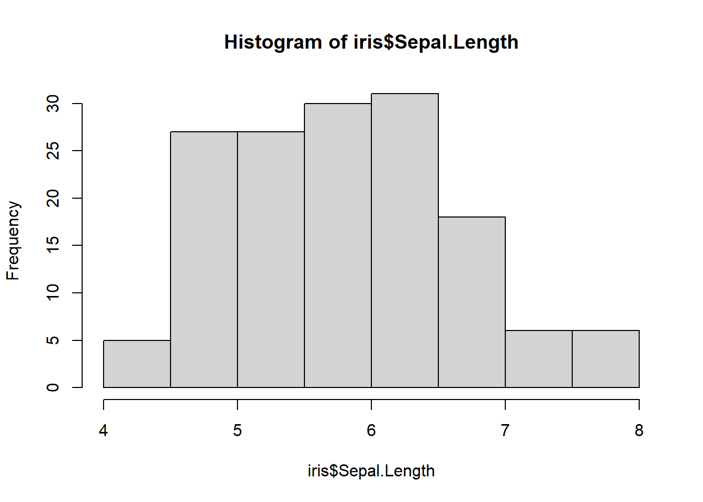
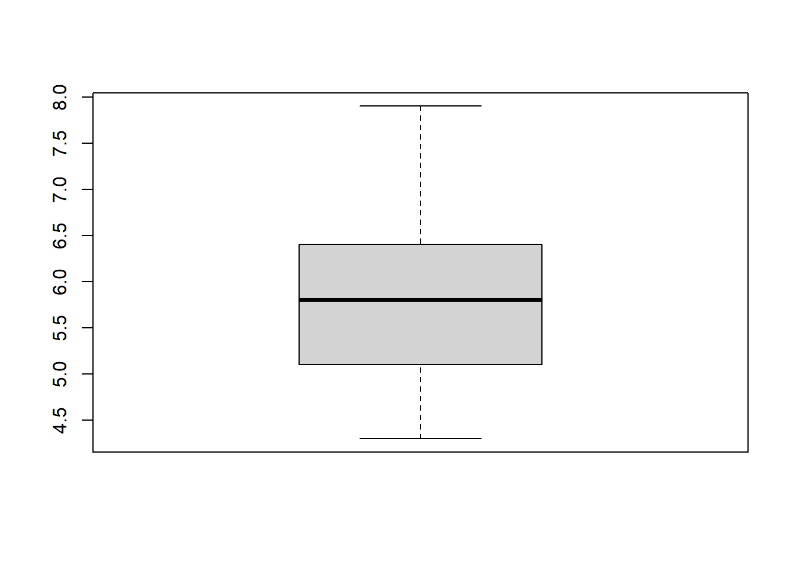
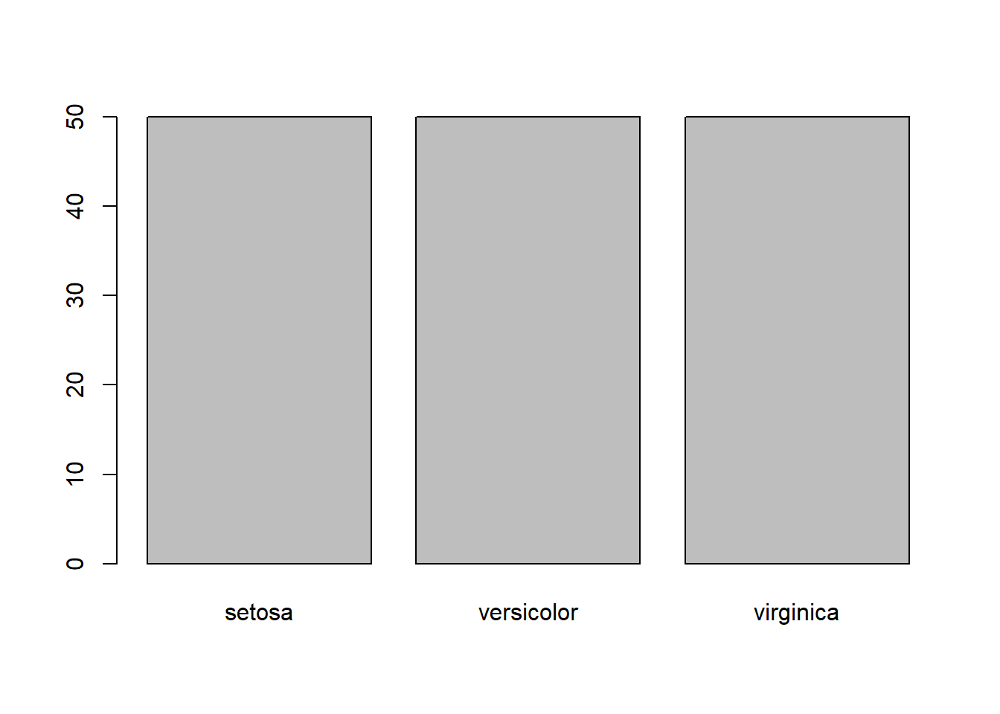
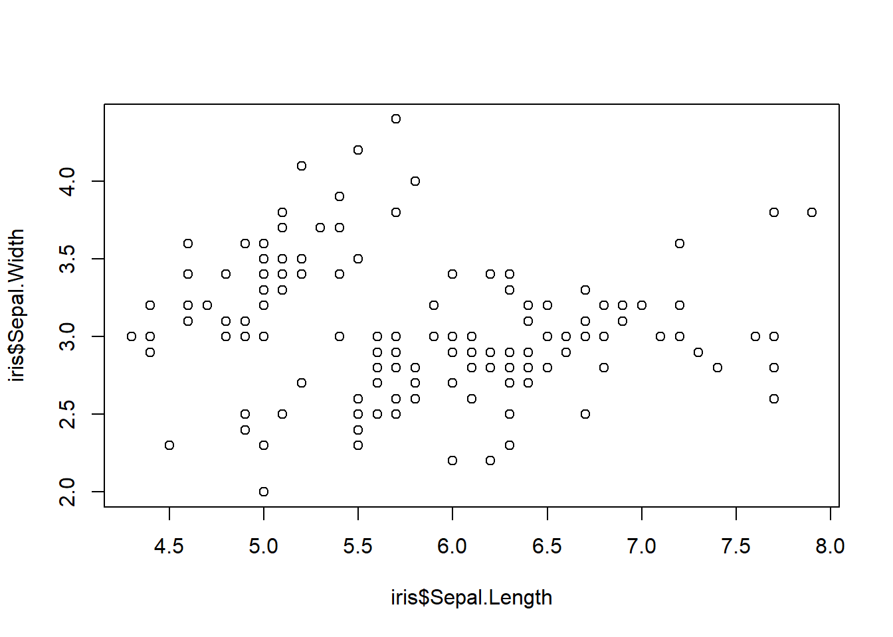
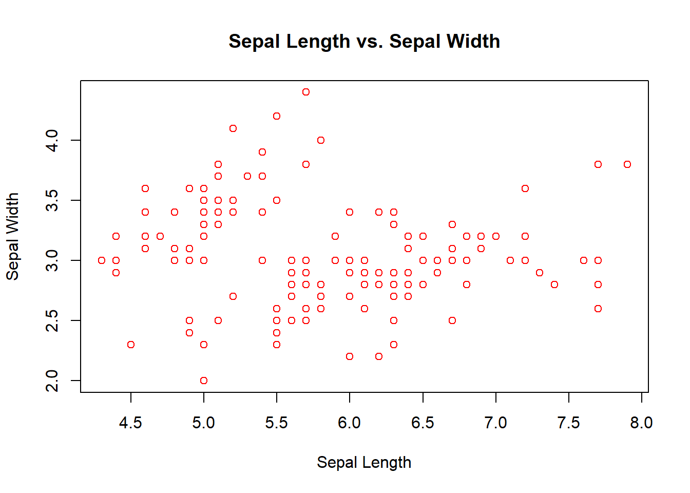

# Basics of R

## Introduction


```r
A <- 2  
```


```r
A # Print A
#> [1] 2
```


```r
A = 2
A
#> [1] 2
```


```r
B <- "Halo Semua"
B
#> [1] "Halo Semua"
```


```r
a<-10 # Space is not sensitive but lettercase is sensitive.
A
#> [1] 2
```


```r
a
#> [1] 10
```


```r
# Arithmetic operation
x <- 5
y <- 3
x + y     
#> [1] 8
x - y     
#> [1] 2
x * y     
#> [1] 15
x / y     
#> [1] 1.666667
```


```r
# Logic operation
a <- TRUE
b <- FALSE
a & b     
#> [1] FALSE
a | b     
#> [1] TRUE
!a        
#> [1] FALSE
```


```r
x <- 5
y <- 3
x > y     
#> [1] TRUE
x < y     
#> [1] FALSE
x == y    
#> [1] FALSE
x >= y    
#> [1] TRUE
x <= y    
#> [1] FALSE
```

## Types of Objects in R

### Vector


```r
a1 <- c(2,4,7,3) # Numeric vector
a2 <- c("one","two","three") # Character vector
a3 <- c(TRUE,TRUE,TRUE,FALSE,TRUE,FALSE) # Logical vector
```


```r
a1
#> [1] 2 4 7 3
a3[4]        
#> [1] FALSE
a2[c(1,3)]   
#> [1] "one"   "three"
a1[-1]       
#> [1] 4 7 3
a1[2:4]      
#> [1] 4 7 3
```


```r
a <- c(1, 2, 3)
b <- c(4, 5, 6)
c <- c(a, b)      
c                 
#> [1] 1 2 3 4 5 6
c[1:3]            
#> [1] 1 2 3
d <- a + b        
d                 
#> [1] 5 7 9
```


```r
a4 <- 1:12 
b1 <- matrix(a4,3,4)
b2 <- matrix(a4,3,4,byrow=TRUE) 
b3 <- matrix(1:14,4,4)
#> Warning in matrix(1:14, 4, 4): data length [14] is not a
#> sub-multiple or multiple of the number of rows [4]
```


```r
b1
#>      [,1] [,2] [,3] [,4]
#> [1,]    1    4    7   10
#> [2,]    2    5    8   11
#> [3,]    3    6    9   12
```

```r
b2
#>      [,1] [,2] [,3] [,4]
#> [1,]    1    2    3    4
#> [2,]    5    6    7    8
#> [3,]    9   10   11   12
```

```r
b3
#>      [,1] [,2] [,3] [,4]
#> [1,]    1    5    9   13
#> [2,]    2    6   10   14
#> [3,]    3    7   11    1
#> [4,]    4    8   12    2
```


```r
b2[2,3]   
#> [1] 7
```


```r
b2[1:2,]  
#>      [,1] [,2] [,3] [,4]
#> [1,]    1    2    3    4
#> [2,]    5    6    7    8
```


```r
b2[c(1,3),-2] 
#>      [,1] [,2] [,3]
#> [1,]    1    3    4
#> [2,]    9   11   12
```


```r
dim(b2) 
#> [1] 3 4
```


```r
m1 <- matrix(c(1, 2, 3, 4, 5, 6), nrow = 2, ncol = 3)
m2 <- matrix(c(7, 8, 9, 10, 11, 12), nrow = 2, ncol = 3)
```


```r
m3 <- m1 + m2
m3
#>      [,1] [,2] [,3]
#> [1,]    8   12   16
#> [2,]   10   14   18
```


```r
m4 <- m1 %*% t(m2)
m4
#>      [,1] [,2]
#> [1,]   89   98
#> [2,]  116  128
```

### Factor


```r
a5 <- c("A","B","AB","O")
d1 <- factor(a5) 
levels(d1)
#> [1] "A"  "AB" "B"  "O"
```


```r
levels(d1) <- c("Darah A","Darah AB","Darah B","Darah O")
d1
#> [1] Darah A  Darah B  Darah AB Darah O 
#> Levels: Darah A Darah AB Darah B Darah O
```


```r
a6 <- c("SMA","SD","SMP","SMA","SMA","SMA","SMA","SMA","SMA","SMA","SMA","SMA","SMA")
d5 <- factor(a6, levels=c("SD","SMP","SMA")) # Skala pengukuran ordinal  
levels(d5) 
#> [1] "SD"  "SMP" "SMA"
```


```r
d5
#>  [1] SMA SD  SMP SMA SMA SMA SMA SMA SMA SMA SMA SMA SMA
#> Levels: SD SMP SMA
```

### List


```r
a1; b2; d1
#> [1] 2 4 7 3
#>      [,1] [,2] [,3] [,4]
#> [1,]    1    2    3    4
#> [2,]    5    6    7    8
#> [3,]    9   10   11   12
#> [1] Darah A  Darah B  Darah AB Darah O 
#> Levels: Darah A Darah AB Darah B Darah O
```


```r
e1 <- list(a1,b2,d1)
e2 <- list(vect=a1,mat=b2,fac=d1) 
e1
#> [[1]]
#> [1] 2 4 7 3
#> 
#> [[2]]
#>      [,1] [,2] [,3] [,4]
#> [1,]    1    2    3    4
#> [2,]    5    6    7    8
#> [3,]    9   10   11   12
#> 
#> [[3]]
#> [1] Darah A  Darah B  Darah AB Darah O 
#> Levels: Darah A Darah AB Darah B Darah O
e2
#> $vect
#> [1] 2 4 7 3
#> 
#> $mat
#>      [,1] [,2] [,3] [,4]
#> [1,]    1    2    3    4
#> [2,]    5    6    7    8
#> [3,]    9   10   11   12
#> 
#> $fac
#> [1] Darah A  Darah B  Darah AB Darah O 
#> Levels: Darah A Darah AB Darah B Darah O
```


```r
e1[[1]][2] 
#> [1] 4
e2$fac 
#> [1] Darah A  Darah B  Darah AB Darah O 
#> Levels: Darah A Darah AB Darah B Darah O
e2[2] 
#> $mat
#>      [,1] [,2] [,3] [,4]
#> [1,]    1    2    3    4
#> [2,]    5    6    7    8
#> [3,]    9   10   11   12
names(e2)
#> [1] "vect" "mat"  "fac"
```

### Data Frame


```r
Angka <- 11:15
Huruf <- factor(LETTERS[6:10])
f1 <- data.frame(Angka,Huruf)
f1
#>   Angka Huruf
#> 1    11     F
#> 2    12     G
#> 3    13     H
#> 4    14     I
#> 5    15     J
```


```r
f1[1,2] 
#> [1] F
#> Levels: F G H I J
f1$Angka 
#> [1] 11 12 13 14 15
f1[,"Huruf"] 
#> [1] F G H I J
#> Levels: F G H I J
colnames(f1) 
#> [1] "Angka" "Huruf"
```


```r
str(f1)
#> 'data.frame':	5 obs. of  2 variables:
#>  $ Angka: int  11 12 13 14 15
#>  $ Huruf: Factor w/ 5 levels "F","G","H","I",..: 1 2 3 4 5
```

## Data Frame Management


```r
data(iris) 
```


```r
head(iris) 
#>   Sepal.Length Sepal.Width Petal.Length Petal.Width Species
#> 1          5.1         3.5          1.4         0.2  setosa
#> 2          4.9         3.0          1.4         0.2  setosa
#> 3          4.7         3.2          1.3         0.2  setosa
#> 4          4.6         3.1          1.5         0.2  setosa
#> 5          5.0         3.6          1.4         0.2  setosa
#> 6          5.4         3.9          1.7         0.4  setosa
```


```r
tail(iris) 
#>     Sepal.Length Sepal.Width Petal.Length Petal.Width
#> 145          6.7         3.3          5.7         2.5
#> 146          6.7         3.0          5.2         2.3
#> 147          6.3         2.5          5.0         1.9
#> 148          6.5         3.0          5.2         2.0
#> 149          6.2         3.4          5.4         2.3
#> 150          5.9         3.0          5.1         1.8
#>       Species
#> 145 virginica
#> 146 virginica
#> 147 virginica
#> 148 virginica
#> 149 virginica
#> 150 virginica
```


```r
str(iris)
#> 'data.frame':	150 obs. of  5 variables:
#>  $ Sepal.Length: num  5.1 4.9 4.7 4.6 5 5.4 4.6 5 4.4 4.9 ...
#>  $ Sepal.Width : num  3.5 3 3.2 3.1 3.6 3.9 3.4 3.4 2.9 3.1 ...
#>  $ Petal.Length: num  1.4 1.4 1.3 1.5 1.4 1.7 1.4 1.5 1.4 1.5 ...
#>  $ Petal.Width : num  0.2 0.2 0.2 0.2 0.2 0.4 0.3 0.2 0.2 0.1 ...
#>  $ Species     : Factor w/ 3 levels "setosa","versicolor",..: 1 1 1 1 1 1 1 1 1 1 ...
```

### R Package


```r
# install.packages("readxl") - code to install R package
library(readxl)
#> Warning: package 'readxl' was built under R version 4.2.3
```


```r
#install.packages("dplyr")
library(dplyr)
#> Warning: package 'dplyr' was built under R version 4.2.3
#> 
#> Attaching package: 'dplyr'
#> The following objects are masked from 'package:stats':
#> 
#>     filter, lag
#> The following objects are masked from 'package:base':
#> 
#>     intersect, setdiff, setequal, union
```

### Data Management With `dplyr`

```r
head(iris)
#>   Sepal.Length Sepal.Width Petal.Length Petal.Width Species
#> 1          5.1         3.5          1.4         0.2  setosa
#> 2          4.9         3.0          1.4         0.2  setosa
#> 3          4.7         3.2          1.3         0.2  setosa
#> 4          4.6         3.1          1.5         0.2  setosa
#> 5          5.0         3.6          1.4         0.2  setosa
#> 6          5.4         3.9          1.7         0.4  setosa
```


```r
irisbaru  <- mutate(iris, sepal2 = Sepal.Length + Sepal.Width)
```


```r
head(irisbaru)
#>   Sepal.Length Sepal.Width Petal.Length Petal.Width Species
#> 1          5.1         3.5          1.4         0.2  setosa
#> 2          4.9         3.0          1.4         0.2  setosa
#> 3          4.7         3.2          1.3         0.2  setosa
#> 4          4.6         3.1          1.5         0.2  setosa
#> 5          5.0         3.6          1.4         0.2  setosa
#> 6          5.4         3.9          1.7         0.4  setosa
#>   sepal2
#> 1    8.6
#> 2    7.9
#> 3    7.9
#> 4    7.7
#> 5    8.6
#> 6    9.3
```


```r
irisetosa <- filter(iris, Species=="setosa")
head(irisetosa)
#>   Sepal.Length Sepal.Width Petal.Length Petal.Width Species
#> 1          5.1         3.5          1.4         0.2  setosa
#> 2          4.9         3.0          1.4         0.2  setosa
#> 3          4.7         3.2          1.3         0.2  setosa
#> 4          4.6         3.1          1.5         0.2  setosa
#> 5          5.0         3.6          1.4         0.2  setosa
#> 6          5.4         3.9          1.7         0.4  setosa
```


```r
levels(iris$Species)
#> [1] "setosa"     "versicolor" "virginica"
```


```r
irisversicolor <- filter(iris, Species=="setosa"& Petal.Length==1.3)
head(irisversicolor)
#>   Sepal.Length Sepal.Width Petal.Length Petal.Width Species
#> 1          4.7         3.2          1.3         0.2  setosa
#> 2          5.4         3.9          1.3         0.4  setosa
#> 3          5.5         3.5          1.3         0.2  setosa
#> 4          4.4         3.0          1.3         0.2  setosa
#> 5          5.0         3.5          1.3         0.3  setosa
#> 6          4.5         2.3          1.3         0.3  setosa
```


```r
iris3 <- select(iris, Sepal.Length, Species)
head(iris3)
#>   Sepal.Length Species
#> 1          5.1  setosa
#> 2          4.9  setosa
#> 3          4.7  setosa
#> 4          4.6  setosa
#> 5          5.0  setosa
#> 6          5.4  setosa
```


```r
iris4 <- arrange(iris, Petal.Width)
head(iris4)
#>   Sepal.Length Sepal.Width Petal.Length Petal.Width Species
#> 1          4.9         3.1          1.5         0.1  setosa
#> 2          4.8         3.0          1.4         0.1  setosa
#> 3          4.3         3.0          1.1         0.1  setosa
#> 4          5.2         4.1          1.5         0.1  setosa
#> 5          4.9         3.6          1.4         0.1  setosa
#> 6          5.1         3.5          1.4         0.2  setosa
```


```r
iris4 <- arrange(iris, Species, desc(Petal.Width))
head(iris4)
#>   Sepal.Length Sepal.Width Petal.Length Petal.Width Species
#> 1          5.0         3.5          1.6         0.6  setosa
#> 2          5.1         3.3          1.7         0.5  setosa
#> 3          5.4         3.9          1.7         0.4  setosa
#> 4          5.7         4.4          1.5         0.4  setosa
#> 5          5.4         3.9          1.3         0.4  setosa
#> 6          5.1         3.7          1.5         0.4  setosa
```


```r
names(iris4)[1] <- "length" 
head(iris4)
#>   length Sepal.Width Petal.Length Petal.Width Species
#> 1    5.0         3.5          1.6         0.6  setosa
#> 2    5.1         3.3          1.7         0.5  setosa
#> 3    5.4         3.9          1.7         0.4  setosa
#> 4    5.7         4.4          1.5         0.4  setosa
#> 5    5.4         3.9          1.3         0.4  setosa
#> 6    5.1         3.7          1.5         0.4  setosa
```


```r
head(iris4[,c(-1,-3)])
#>   Sepal.Width Petal.Width Species
#> 1         3.5         0.6  setosa
#> 2         3.3         0.5  setosa
#> 3         3.9         0.4  setosa
#> 4         4.4         0.4  setosa
#> 5         3.9         0.4  setosa
#> 6         3.7         0.4  setosa
```


```r
iris %>% group_by(Species) %>% summarise(rata2_Sepal.Width = mean(Sepal.Width))
#> # A tibble: 3 × 2
#>   Species    rata2_Sepal.Width
#>   <fct>                  <dbl>
#> 1 setosa                  3.43
#> 2 versicolor              2.77
#> 3 virginica               2.97
```


## Visualization

### Histogram


```r
hist(iris$Sepal.Length)
```



### Box Plot


```r
boxplot(iris$Sepal.Length)
```



### Barplot


```r
table(iris$Species)
#> 
#>     setosa versicolor  virginica 
#>         50         50         50
```


```r
barplot(table(iris$Species))
```



### Pie Chart


```r
pie(table(iris$Species))
```


### Scatter Plot


```r
plot(iris$Sepal.Length,iris$Sepal.Width)
```




```r
plot(iris$Sepal.Length, iris$Sepal.Width, main = "Sepal Length vs. Sepal Width", 
     xlab = "Sepal Length", ylab = "Sepal Width", col = "red")
```


