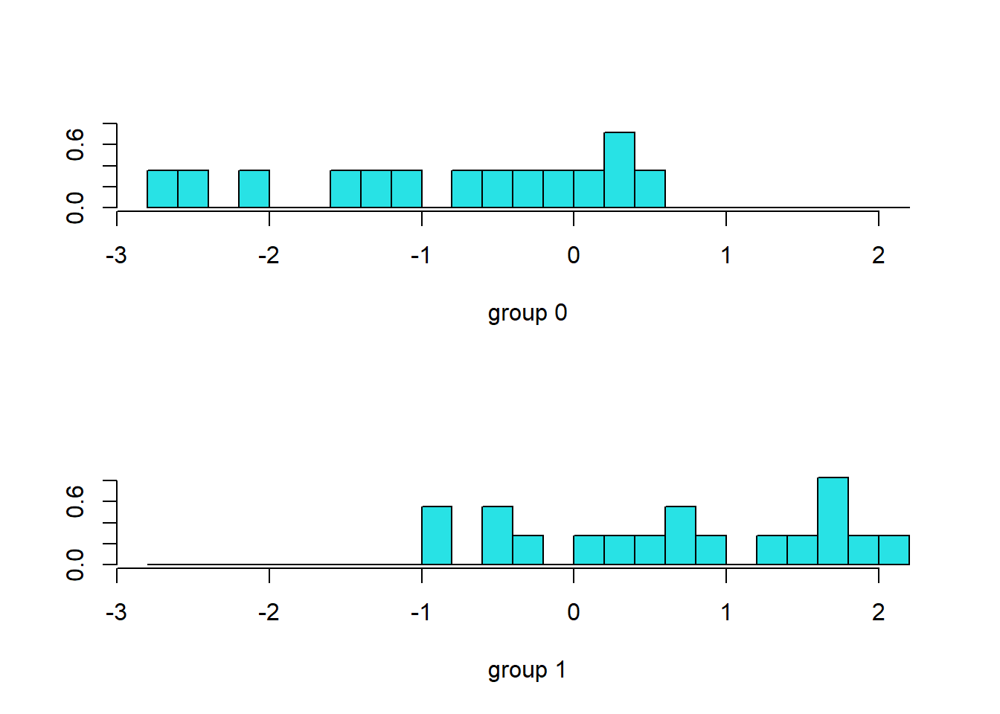
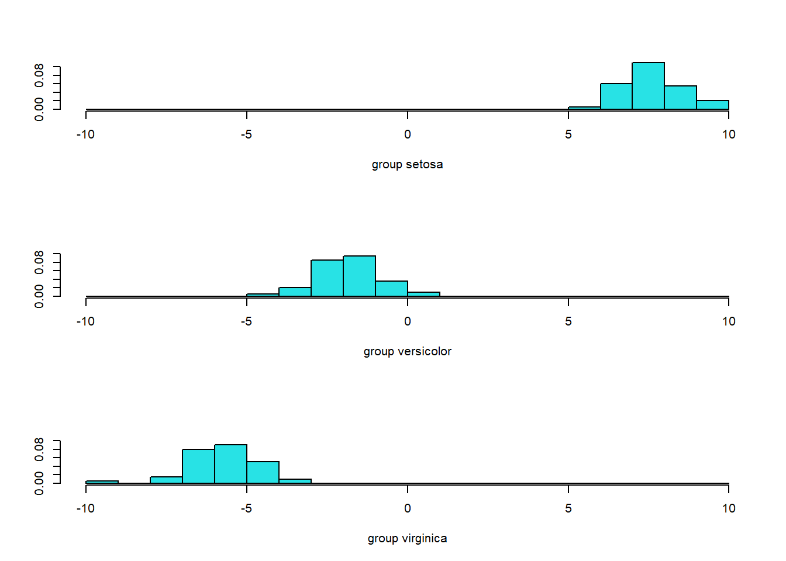
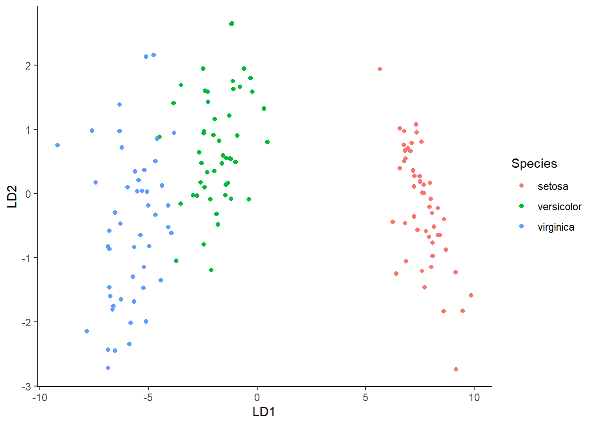

# Discriminant Analysis

## Analisis Diskriminan Dua Grup

### Data


``` r
library(readxl)
pinjaman <- read_excel("Data/pinjaman.xlsx")
head(pinjaman,10)
#> # A tibble: 10 × 6
#>       X1    X2    X3    X4    X5     Y
#>    <dbl> <dbl> <dbl> <dbl> <dbl> <dbl>
#>  1    98    35    12     4     4     1
#>  2    65    44     5     3     1     1
#>  3    22    50     0     2     7     1
#>  4    78    60    34     5     5     1
#>  5    50    31     4     2     2     1
#>  6    21    30     5     3     7     1
#>  7    42    32    21     4    11     1
#>  8    20    41    10     2     3     1
#>  9    33    25     0     3     6     1
#> 10    57    32     8     2     5     1
```


``` r
str(pinjaman)
#> tibble [32 × 6] (S3: tbl_df/tbl/data.frame)
#>  $ X1: num [1:32] 98 65 22 78 50 21 42 20 33 57 ...
#>  $ X2: num [1:32] 35 44 50 60 31 30 32 41 25 32 ...
#>  $ X3: num [1:32] 12 5 0 34 4 5 21 10 0 8 ...
#>  $ X4: num [1:32] 4 3 2 5 2 3 4 2 3 2 ...
#>  $ X5: num [1:32] 4 1 7 5 2 7 11 3 6 5 ...
#>  $ Y : num [1:32] 1 1 1 1 1 1 1 1 1 1 ...
```


``` r
pinjaman$Y <- as.factor(pinjaman$Y)
str(pinjaman)
#> tibble [32 × 6] (S3: tbl_df/tbl/data.frame)
#>  $ X1: num [1:32] 98 65 22 78 50 21 42 20 33 57 ...
#>  $ X2: num [1:32] 35 44 50 60 31 30 32 41 25 32 ...
#>  $ X3: num [1:32] 12 5 0 34 4 5 21 10 0 8 ...
#>  $ X4: num [1:32] 4 3 2 5 2 3 4 2 3 2 ...
#>  $ X5: num [1:32] 4 1 7 5 2 7 11 3 6 5 ...
#>  $ Y : Factor w/ 2 levels "0","1": 2 2 2 2 2 2 2 2 2 2 ...
```


``` r
library(psych)
pairs.panels(pinjaman[1:5],
             gap = 0,
             bg = c("red", "green")[pinjaman$Y],
             pch = 21)
```


### Pemodelan Linier


``` r
library(MASS)
modellda1 <- lda(Y ~ X1 + X2 + X3 + X4 + X5, data=pinjaman)
modellda1
#> Call:
#> lda(Y ~ X1 + X2 + X3 + X4 + X5, data = pinjaman)
#> 
#> Prior probabilities of groups:
#>      0      1 
#> 0.4375 0.5625 
#> 
#> Group means:
#>         X1       X2       X3       X4       X5
#> 0 23.07143 26.78571 23.21429 3.428571 4.071429
#> 1 44.33333 34.38889 11.72222 2.888889 4.500000
#> 
#> Coefficients of linear discriminants:
#>             LD1
#> X1  0.037015853
#> X2 -0.004820049
#> X3 -0.043555291
#> X4 -0.477408359
#> X5 -0.008483836
```

### Uji Signifikansi Fungsi Diskriminan


``` r
m <- manova(cbind(pinjaman$X1,pinjaman$X2,pinjaman$X3,
                  pinjaman$X4,pinjaman$X5) ~ pinjaman$Y)
summary(m, test = 'Wilks')
#>            Df   Wilks approx F num Df den Df  Pr(>F)  
#> pinjaman$Y  1 0.62715   3.0915      5     26 0.02544 *
#> Residuals  30                                         
#> ---
#> Signif. codes:  
#> 0 '***' 0.001 '**' 0.01 '*' 0.05 '.' 0.1 ' ' 1
```

### Akurasi


``` r
p <- predict(modellda1, pinjaman)
ldahist(data = p$x, g = pinjaman$Y)
```




``` r
library(caret)
#> Loading required package: ggplot2
#> Warning: package 'ggplot2' was built under R version 4.4.3
#> 
#> Attaching package: 'ggplot2'
#> The following objects are masked from 'package:psych':
#> 
#>     %+%, alpha
#> Loading required package: lattice
confusionMatrix(p$class,pinjaman$Y)
#> Confusion Matrix and Statistics
#> 
#>           Reference
#> Prediction  0  1
#>          0  9  4
#>          1  5 14
#>                                           
#>                Accuracy : 0.7188          
#>                  95% CI : (0.5325, 0.8625)
#>     No Information Rate : 0.5625          
#>     P-Value [Acc > NIR] : 0.0523          
#>                                           
#>                   Kappa : 0.424           
#>                                           
#>  Mcnemar's Test P-Value : 1.0000          
#>                                           
#>             Sensitivity : 0.6429          
#>             Specificity : 0.7778          
#>          Pos Pred Value : 0.6923          
#>          Neg Pred Value : 0.7368          
#>              Prevalence : 0.4375          
#>          Detection Rate : 0.2812          
#>    Detection Prevalence : 0.4062          
#>       Balanced Accuracy : 0.7103          
#>                                           
#>        'Positive' Class : 0               
#> 
```


``` r
mean(p$class==pinjaman$Y)
#> [1] 0.71875
```


``` r
#install.packages("klaR")
library(klaR)
#> Warning: package 'klaR' was built under R version 4.4.3
#Partition plot
partimat(Y~., data = pinjaman, method = "lda")
```


``` r
partimat(Y~., data = pinjaman, method = "qda")
```


### Pemodelan Quadratik


``` r
modellda2 <- qda(Y ~ X1 + X2 + X3 + X4 + X5, data=pinjaman)
modellda2
#> Call:
#> qda(Y ~ X1 + X2 + X3 + X4 + X5, data = pinjaman)
#> 
#> Prior probabilities of groups:
#>      0      1 
#> 0.4375 0.5625 
#> 
#> Group means:
#>         X1       X2       X3       X4       X5
#> 0 23.07143 26.78571 23.21429 3.428571 4.071429
#> 1 44.33333 34.38889 11.72222 2.888889 4.500000
```


``` r
p <- predict(modellda2, pinjaman)
mean(p$class==pinjaman$Y)
#> [1] 0.84375
```

### Tipe Diskriminan Lainnya


``` r
# Mixture discriminant analysis - MDA
# install.packages("mda")
library(mda)
#> Warning: package 'mda' was built under R version 4.4.3
#> Loading required package: class
#> Loaded mda 0.5-5
modellda3 <- mda(Y ~ X1 + X2 + X3 + X4 + X5, data=pinjaman)
p <- predict(modellda3, pinjaman)
mean(p==pinjaman$Y)
#> [1] 0.84375
```


``` r
# Flexible discriminant analysis - FDA
modellda4 <- fda(Y ~ X1 + X2 + X3 + X4 + X5, data=pinjaman)
p <- predict(modellda4, pinjaman)
mean(p==pinjaman$Y)
#> [1] 0.71875
```


``` r
# Regularized discriminant analysis - RDA
modellda5 <- rda(Y ~ X1 + X2 + X3 + X4 + X5, data=pinjaman)
p <- predict(modellda5, pinjaman)
mean(p$class==pinjaman$Y)
#> [1] 0.75
```

## Analisis Diskriminan Tiga Grup

### Data


``` r
data("iris")
head(iris)
#>   Sepal.Length Sepal.Width Petal.Length Petal.Width Species
#> 1          5.1         3.5          1.4         0.2  setosa
#> 2          4.9         3.0          1.4         0.2  setosa
#> 3          4.7         3.2          1.3         0.2  setosa
#> 4          4.6         3.1          1.5         0.2  setosa
#> 5          5.0         3.6          1.4         0.2  setosa
#> 6          5.4         3.9          1.7         0.4  setosa
```


``` r
str(iris)
#> 'data.frame':	150 obs. of  5 variables:
#>  $ Sepal.Length: num  5.1 4.9 4.7 4.6 5 5.4 4.6 5 4.4 4.9 ...
#>  $ Sepal.Width : num  3.5 3 3.2 3.1 3.6 3.9 3.4 3.4 2.9 3.1 ...
#>  $ Petal.Length: num  1.4 1.4 1.3 1.5 1.4 1.7 1.4 1.5 1.4 1.5 ...
#>  $ Petal.Width : num  0.2 0.2 0.2 0.2 0.2 0.4 0.3 0.2 0.2 0.1 ...
#>  $ Species     : Factor w/ 3 levels "setosa","versicolor",..: 1 1 1 1 1 1 1 1 1 1 ...
```


``` r
library(MASS)
lda.iris <- lda(Species ~ ., iris)
lda.iris 
#> Call:
#> lda(Species ~ ., data = iris)
#> 
#> Prior probabilities of groups:
#>     setosa versicolor  virginica 
#>  0.3333333  0.3333333  0.3333333 
#> 
#> Group means:
#>            Sepal.Length Sepal.Width Petal.Length
#> setosa            5.006       3.428        1.462
#> versicolor        5.936       2.770        4.260
#> virginica         6.588       2.974        5.552
#>            Petal.Width
#> setosa           0.246
#> versicolor       1.326
#> virginica        2.026
#> 
#> Coefficients of linear discriminants:
#>                     LD1         LD2
#> Sepal.Length  0.8293776 -0.02410215
#> Sepal.Width   1.5344731 -2.16452123
#> Petal.Length -2.2012117  0.93192121
#> Petal.Width  -2.8104603 -2.83918785
#> 
#> Proportion of trace:
#>    LD1    LD2 
#> 0.9912 0.0088
```

### Uji Signifikansi Fungsi Diskriminan


``` r
m <- manova(cbind(iris$Sepal.Length,iris$Sepal.Width,iris$Petal.Length,
                  iris$Petal.Width) ~ iris$Species)
summary(m, test = 'Wilks')
#>               Df    Wilks approx F num Df den Df    Pr(>F)
#> iris$Species   2 0.023439   199.15      8    288 < 2.2e-16
#> Residuals    147                                          
#>                 
#> iris$Species ***
#> Residuals       
#> ---
#> Signif. codes:  
#> 0 '***' 0.001 '**' 0.01 '*' 0.05 '.' 0.1 ' ' 1
```

### Akurasi


``` r
p <- predict(lda.iris, iris)
ldahist(data = p$x, g = iris$Species)
```




``` r
table(p$class,iris$Species)
#>             
#>              setosa versicolor virginica
#>   setosa         50          0         0
#>   versicolor      0         48         1
#>   virginica       0          2        49
```


``` r
mean(p$class==iris$Species)
#> [1] 0.98
```

### Visualisasi


``` r
library(ggplot2)
lda.data <- cbind(iris,  p$x)
ggplot(lda.data, aes(LD1, LD2)) +
  geom_point(aes(color = Species)) + theme_classic()
```



### Pemodelan Quadratik


``` r
qda.iris <- qda(Species ~ ., data=iris)
qda.iris
#> Call:
#> qda(Species ~ ., data = iris)
#> 
#> Prior probabilities of groups:
#>     setosa versicolor  virginica 
#>  0.3333333  0.3333333  0.3333333 
#> 
#> Group means:
#>            Sepal.Length Sepal.Width Petal.Length
#> setosa            5.006       3.428        1.462
#> versicolor        5.936       2.770        4.260
#> virginica         6.588       2.974        5.552
#>            Petal.Width
#> setosa           0.246
#> versicolor       1.326
#> virginica        2.026
p <- predict(qda.iris, iris)
mean(p$class==iris$Species)
#> [1] 0.98
```

### Tipe Diskriminan Lainnya


``` r
# Mixture discriminant analysis - MDA
# install.packages("mda")
library(mda)
mda.iris <- mda(Species ~ ., data=iris)
mda.iris
#> Call:
#> mda(formula = Species ~ ., data = iris)
#> 
#> Dimension: 4 
#> 
#> Percent Between-Group Variance Explained:
#>     v1     v2     v3     v4 
#>  95.26  97.78  99.56 100.00 
#> 
#> Degrees of Freedom (per dimension): 5 
#> 
#> Training Misclassification Error: 0.01333 ( N = 150 )
#> 
#> Deviance: 13.229
p <- predict(mda.iris, iris)
mean(p==iris$Species)
#> [1] 0.9866667
```


``` r
# Flexible discriminant analysis - FDA
fda.iris <- fda(Species ~ ., data=iris)
fda.iris
#> Call:
#> fda(formula = Species ~ ., data = iris)
#> 
#> Dimension: 2 
#> 
#> Percent Between-Group Variance Explained:
#>     v1     v2 
#>  99.12 100.00 
#> 
#> Degrees of Freedom (per dimension): 5 
#> 
#> Training Misclassification Error: 0.02 ( N = 150 )
p <- predict(fda.iris, iris)
mean(p==iris$Species)
#> [1] 0.98
```


``` r
# Regularized discriminant analysis - RDA
rda.iris <- rda(Species ~ ., data=iris)
rda.iris
#> Call: 
#> rda(formula = Species ~ ., data = iris)
#> 
#> Regularization parameters: 
#>     gamma    lambda 
#> 0.1678610 0.4041377 
#> 
#> Prior probabilities of groups: 
#>     setosa versicolor  virginica 
#>  0.3333333  0.3333333  0.3333333 
#> 
#> Misclassification rate: 
#>        apparent: 2 %
#> cross-validated: 2 %
p <- predict(rda.iris, iris)
mean(p$class==iris$Species)
#> [1] 0.98
```
