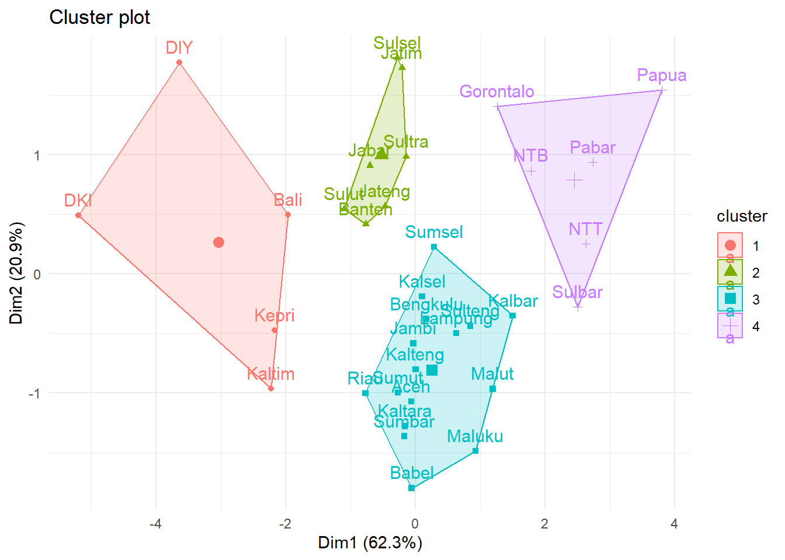

# Cluster Analysis

## Metode berhirarki

Ref:
https://rpubs.com/odenipinedo/cluster-analysis-in-R


``` r
library(readxl)
Provinsi <- read_excel("Data/provinsi.xlsx")
Prov.scaled = scale(Provinsi[,c(4:8)])
rownames(Prov.scaled) = Provinsi$Provinsi
head(Prov.scaled)
#>                IPM         UHH        RLS         PPK
#> Aceh    0.20822137  0.04044611  0.7444782 -0.62264434
#> Sumut   0.20085709 -0.39282591  1.0245728 -0.11277090
#> Sumbar  0.36532598 -0.23835502  0.4747574  0.01481560
#> Riau    0.50033775  0.59428078  0.5162529  0.19012890
#> Jambi   0.05848104  0.50762638 -0.1165536 -0.18648754
#> Sumsel -0.21890679 -0.08765171 -0.2825356 -0.02582306
#>              Gini
#> Aceh   -0.8089350
#> Sumut  -0.6516207
#> Sumbar -1.2546590
#> Riau   -0.9138112
#> Jambi  -0.6778397
#> Sumsel  0.1349510
```


``` r
## membuat dissimilarity matrix
dprov = dist(Prov.scaled, method="euclidean")
```


``` r
c.comp = hclust(dprov, method = "complete")
cor(dprov , cophenetic(c.comp))
#> [1] 0.7853523
```


``` r
c.sing = hclust(dprov, method = "single")
cor(dprov , cophenetic(c.sing))
#> [1] 0.7905858
```


``` r
c.avrg = hclust(dprov, method = "average")
cor(dprov , cophenetic(c.avrg))
#> [1] 0.8092689
```


``` r
c.ward = hclust(dprov, method = "ward.D")
cor(dprov , cophenetic(c.ward))
#> [1] 0.5336018
```


``` r
c.ctrd = hclust(dprov, method = "centroid")
cor(dprov , cophenetic(c.ctrd))
#> [1] 0.7700878
```


``` r
library(factoextra)
#> Loading required package: ggplot2
#> Warning: package 'ggplot2' was built under R version 4.4.3
#> Welcome! Want to learn more? See two factoextra-related books at https://goo.gl/ve3WBa
fviz_dend(c.avrg, cex = 0.5, 
          main = "Cluster Dendrogram average linkage")
#> Warning: The `<scale>` argument of `guides()` cannot be `FALSE`. Use
#> "none" instead as of ggplot2 3.3.4.
#> ℹ The deprecated feature was likely used in the factoextra
#>   package.
#>   Please report the issue at
#>   <https://github.com/kassambara/factoextra/issues>.
#> This warning is displayed once every 8 hours.
#> Call `lifecycle::last_lifecycle_warnings()` to see where
#> this warning was generated.
```


``` r
avg_coph <- cophenetic(c.avrg)
avg_clust <- cutree(c.avrg, k = 4)
table(avg_clust)
#> avg_clust
#>  1  2  3  4 
#> 26  1  1  6
```


``` r
fviz_dend(c.avrg, k = 4, 
          k_colors = "jco", 
          rect = T, 
          main = "Average Linkage Cluster")
```


``` r
library(clValid)
#> Warning: package 'clValid' was built under R version 4.4.3
#> Loading required package: cluster
library(cluster)
# internal measures
internal <- clValid(Prov.scaled, nClust = 2:6, 
                    clMethods = "hierarchical", 
                    validation = "internal", 
                    metric = "euclidean",
                    method = "average")
summary(internal)
#> 
#> Clustering Methods:
#>  hierarchical 
#> 
#> Cluster sizes:
#>  2 3 4 5 6 
#> 
#> Validation Measures:
#>                                  2       3       4       5       6
#>                                                                   
#> hierarchical Connectivity   4.5246 10.3012 11.6345 18.3198 24.1508
#>              Dunn           0.3637  0.3703  0.3703  0.3224  0.3592
#>              Silhouette     0.4915  0.3484  0.3092  0.2567  0.3117
#> 
#> Optimal Scores:
#> 
#>              Score  Method       Clusters
#> Connectivity 4.5246 hierarchical 2       
#> Dunn         0.3703 hierarchical 3       
#> Silhouette   0.4915 hierarchical 2
```


``` r
fviz_dend(c.avrg, k = 2, 
          k_colors = "jco", 
          rect = T, 
          main = "Average Linkage Cluster")
```


``` r
group = cutree(c.avrg, k = 2)
group
#>      Aceh     Sumut    Sumbar      Riau     Jambi    Sumsel 
#>         1         1         1         1         1         1 
#>  Bengkulu   Lampung     Babel     Kepri       DKI     Jabar 
#>         1         1         1         1         2         1 
#>    Jateng       DIY     Jatim    Banten      Bali       NTB 
#>         1         2         1         1         1         1 
#>       NTT    Kalbar   Kalteng    Kalsel    Kaltim   Kaltara 
#>         1         1         1         1         1         1 
#>     Sulut   Sulteng    Sulsel    Sultra Gorontalo    Sulbar 
#>         1         1         1         1         1         1 
#>    Maluku     Malut     Pabar     Papua 
#>         1         1         1         1
```


``` r
fviz_cluster(list(data = Prov.scaled, 
                  cluster = group)) + 
  theme_minimal()
```


``` r
prcomp(Prov.scaled)
#> Standard deviations (1, .., p=5):
#> [1] 1.7653705 1.0227284 0.7270850 0.5299864 0.1671984
#> 
#> Rotation (n x k) = (5 x 5):
#>             PC1         PC2          PC3           PC4
#> IPM  -0.5601680 -0.05311199 -0.005227509 -0.0006949187
#> UHH  -0.4513030  0.05646383 -0.811065327  0.2024129889
#> RLS  -0.4591728 -0.33781331  0.497619343  0.5648220282
#> PPK  -0.5069166  0.09086739  0.227624805 -0.7546468667
#> Gini -0.1213811  0.93360390  0.206658283  0.2655422416
#>              PC5
#> IPM  -0.82665781
#> UHH   0.30714735
#> RLS   0.32923179
#> PPK   0.33685862
#> Gini  0.02073819
```

## Metode tidak berhirarki - kmeans


``` r
fviz_nbclust(Prov.scaled, kmeans, method = "wss")
```


``` r
fviz_nbclust(Prov.scaled, kmeans, method = "silhouette")
```


``` r
set.seed(1)
km = kmeans(Prov.scaled, centers=4)
km
#> K-means clustering with 4 clusters of sizes 5, 7, 16, 6
#> 
#> Cluster means:
#>           IPM        UHH        RLS         PPK       Gini
#> 1  1.67223995  1.1202353  1.3689855  1.75840321  0.6331131
#> 2  0.22785944  0.6620973 -0.1491572  0.09292014  0.9739608
#> 3 -0.08819085 -0.1001318  0.1246391 -0.24567350 -0.7991029
#> 4 -1.42419372 -1.4389581 -1.2991755 -0.91861351  0.4670591
#> 
#> Clustering vector:
#>      Aceh     Sumut    Sumbar      Riau     Jambi    Sumsel 
#>         3         3         3         3         3         3 
#>  Bengkulu   Lampung     Babel     Kepri       DKI     Jabar 
#>         3         3         3         1         1         2 
#>    Jateng       DIY     Jatim    Banten      Bali       NTB 
#>         2         1         2         2         1         4 
#>       NTT    Kalbar   Kalteng    Kalsel    Kaltim   Kaltara 
#>         4         3         3         3         1         3 
#>     Sulut   Sulteng    Sulsel    Sultra Gorontalo    Sulbar 
#>         2         3         2         2         4         4 
#>    Maluku     Malut     Pabar     Papua 
#>         3         3         4         4 
#> 
#> Within cluster sum of squares by cluster:
#> [1] 17.054859  7.933134 22.111511  7.711994
#>  (between_SS / total_SS =  66.8 %)
#> 
#> Available components:
#> 
#> [1] "cluster"      "centers"      "totss"       
#> [4] "withinss"     "tot.withinss" "betweenss"   
#> [7] "size"         "iter"         "ifault"
```


``` r
fviz_cluster(list(data = Prov.scaled, cluster = km$cluster)) + theme_minimal()
```


