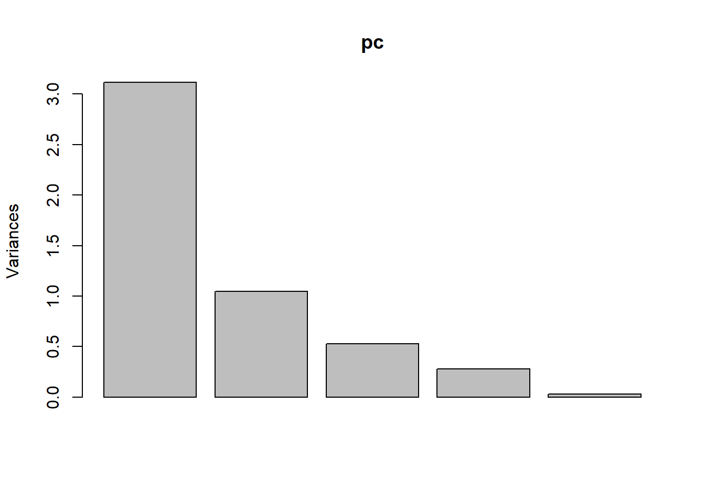
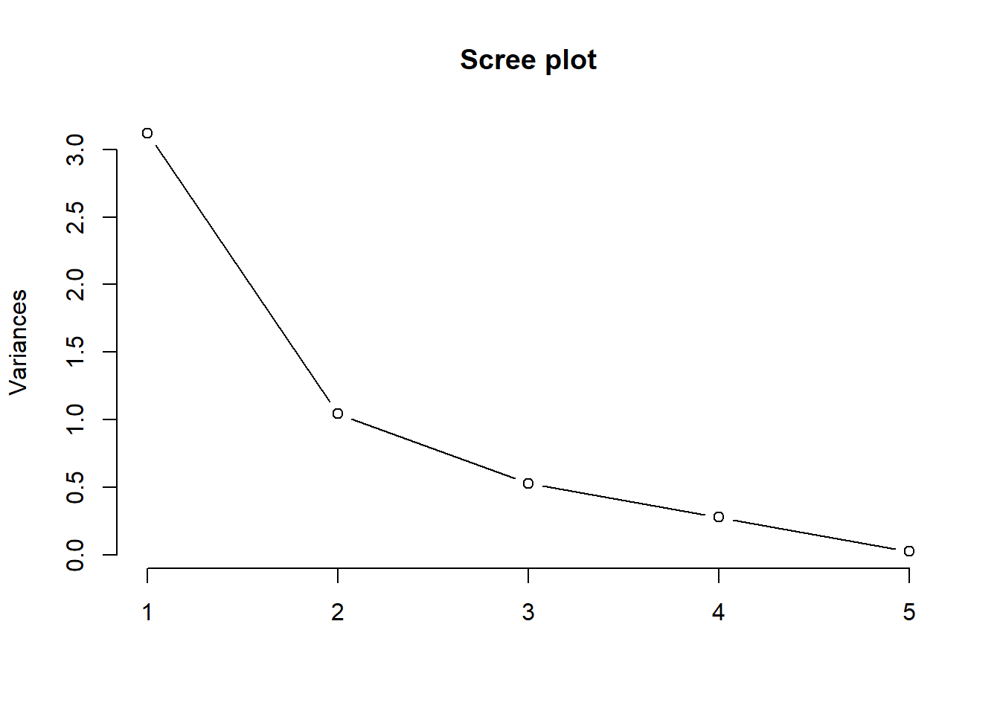
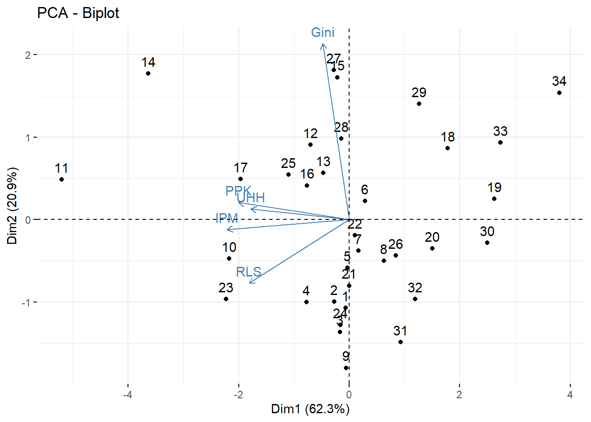
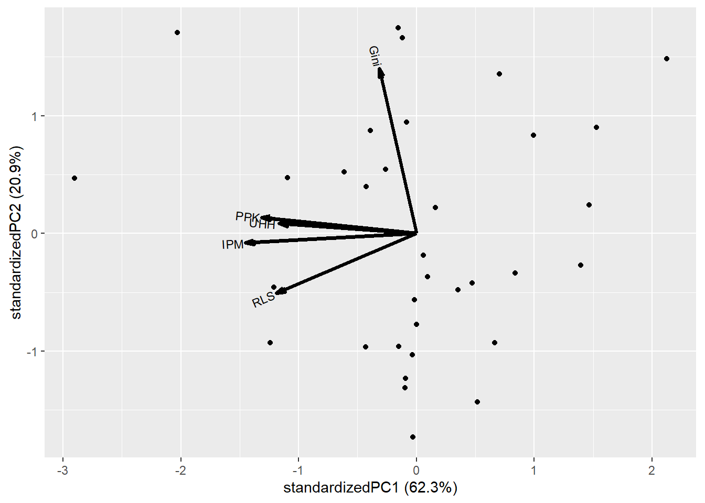
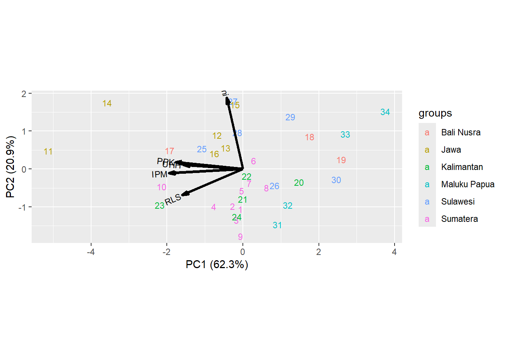
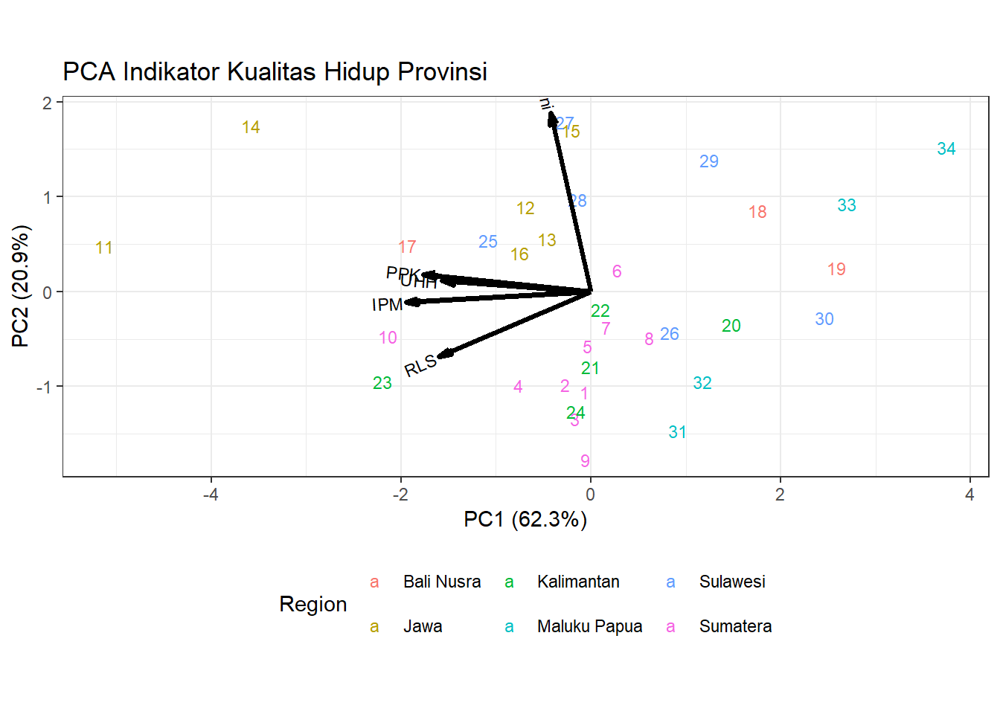

# PCA Analysis and Biplot

## PCA


``` r
# impor data dari excel, beri nama: Provinsi
library(readxl)
Provinsi = read_excel("Data/provinsi.xlsx")
Prov.scaled = scale(Provinsi[,c(4:8)])
round(cor(Prov.scaled),3)
#>        IPM   UHH    RLS   PPK   Gini
#> IPM  1.000 0.780  0.811 0.872  0.159
#> UHH  0.780 1.000  0.447 0.581  0.153
#> RLS  0.811 0.447  1.000 0.637 -0.059
#> PPK  0.872 0.581  0.637 1.000  0.249
#> Gini 0.159 0.153 -0.059 0.249  1.000
```


``` r
# PCA langkah manual
Prov.eigen = eigen(cov(Prov.scaled))
Prov.eigen
#> eigen() decomposition
#> $values
#> [1] 3.11653307 1.04597347 0.52865259 0.28088555 0.02795532
#> 
#> $vectors
#>            [,1]        [,2]         [,3]          [,4]
#> [1,] -0.5601680 -0.05311199  0.005227509 -0.0006949187
#> [2,] -0.4513030  0.05646383  0.811065327  0.2024129889
#> [3,] -0.4591728 -0.33781331 -0.497619343  0.5648220282
#> [4,] -0.5069166  0.09086739 -0.227624805 -0.7546468667
#> [5,] -0.1213811  0.93360390 -0.206658283  0.2655422416
#>             [,5]
#> [1,]  0.82665781
#> [2,] -0.30714735
#> [3,] -0.32923179
#> [4,] -0.33685862
#> [5,] -0.02073819
```


``` r
Prov.eigen$values
#> [1] 3.11653307 1.04597347 0.52865259 0.28088555 0.02795532
Prov.eigen$values/5
#> [1] 0.623306615 0.209194694 0.105730518 0.056177109
#> [5] 0.005591064
cumsum(Prov.eigen$values/5)
#> [1] 0.6233066 0.8325013 0.9382318 0.9944089 1.0000000
```


``` r
Prov.pc = as.matrix(Prov.scaled) %*% Prov.eigen$vectors
round(Prov.pc,3)
#>         [,1]   [,2]   [,3]   [,4]   [,5]
#>  [1,] -0.063 -1.072 -0.028  0.684  0.141
#>  [2,] -0.269 -0.998 -0.667  0.411  0.001
#>  [3,] -0.170 -1.363 -0.172 -0.125  0.240
#>  [4,] -0.771 -1.003  0.373  0.025  0.016
#>  [5,] -0.032 -0.585  0.653 -0.002  0.008
#>  [6,]  0.289  0.226  0.046 -0.122 -0.055
#>  [7,]  0.167 -0.380 -0.246  0.160  0.149
#>  [8,]  0.632 -0.498  0.644 -0.115 -0.054
#>  [9,] -0.057 -1.798  0.675 -1.464 -0.089
#> [10,] -2.171 -0.475 -1.111 -0.280 -0.100
#> [11,] -5.201  0.488 -1.517 -0.455 -0.423
#> [12,] -0.699  0.908  0.818  0.388 -0.141
#> [13,] -0.467  0.567  1.901 -0.226 -0.064
#> [14,] -3.637  1.770  0.377  0.349  0.361
#> [15,] -0.211  1.726  0.527 -0.300  0.118
#> [16,] -0.763  0.414 -0.365 -0.198  0.007
#> [17,] -1.962  0.494  0.024 -0.719  0.052
#> [18,]  1.779  0.864 -0.537 -0.824  0.322
#> [19,]  2.630  0.251 -0.136  0.131  0.011
#> [20,]  1.501 -0.351  1.137 -0.243 -0.049
#> [21,]  0.004 -0.801  0.195 -0.277 -0.039
#> [22,]  0.104 -0.191 -0.358 -0.828  0.030
#> [23,] -2.225 -0.963  0.752  0.305  0.020
#> [24,] -0.162 -1.278  1.179  0.698 -0.173
#> [25,] -1.101  0.544 -0.154  0.823 -0.143
#> [26,]  0.847 -0.438 -0.472  0.097  0.061
#> [27,] -0.276  1.813 -0.105  0.254  0.105
#> [28,] -0.147  0.982  0.109  0.925 -0.004
#> [29,]  1.266  1.405 -0.356 -0.169  0.136
#> [30,]  2.501 -0.280 -0.787 -0.540  0.062
#> [31,]  0.929 -1.487 -1.397  0.735  0.080
#> [32,]  1.193 -0.966 -0.326  0.739 -0.008
#> [33,]  2.735  0.936 -0.533  0.218 -0.091
#> [34,]  3.806  1.539 -0.145 -0.057 -0.487
```


``` r
# dengan fungsi prcomp
pc = prcomp(x = Prov.scaled, center=TRUE, scale=TRUE)
summary(pc)
#> Importance of components:
#>                           PC1    PC2    PC3     PC4     PC5
#> Standard deviation     1.7654 1.0227 0.7271 0.52999 0.16720
#> Proportion of Variance 0.6233 0.2092 0.1057 0.05618 0.00559
#> Cumulative Proportion  0.6233 0.8325 0.9382 0.99441 1.00000
round(pc$x,3)#scores
#>          PC1    PC2    PC3    PC4    PC5
#>  [1,] -0.063 -1.072  0.028  0.684 -0.141
#>  [2,] -0.269 -0.998  0.667  0.411 -0.001
#>  [3,] -0.170 -1.363  0.172 -0.125 -0.240
#>  [4,] -0.771 -1.003 -0.373  0.025 -0.016
#>  [5,] -0.032 -0.585 -0.653 -0.002 -0.008
#>  [6,]  0.289  0.226 -0.046 -0.122  0.055
#>  [7,]  0.167 -0.380  0.246  0.160 -0.149
#>  [8,]  0.632 -0.498 -0.644 -0.115  0.054
#>  [9,] -0.057 -1.798 -0.675 -1.464  0.089
#> [10,] -2.171 -0.475  1.111 -0.280  0.100
#> [11,] -5.201  0.488  1.517 -0.455  0.423
#> [12,] -0.699  0.908 -0.818  0.388  0.141
#> [13,] -0.467  0.567 -1.901 -0.226  0.064
#> [14,] -3.637  1.770 -0.377  0.349 -0.361
#> [15,] -0.211  1.726 -0.527 -0.300 -0.118
#> [16,] -0.763  0.414  0.365 -0.198 -0.007
#> [17,] -1.962  0.494 -0.024 -0.719 -0.052
#> [18,]  1.779  0.864  0.537 -0.824 -0.322
#> [19,]  2.630  0.251  0.136  0.131 -0.011
#> [20,]  1.501 -0.351 -1.137 -0.243  0.049
#> [21,]  0.004 -0.801 -0.195 -0.277  0.039
#> [22,]  0.104 -0.191  0.358 -0.828 -0.030
#> [23,] -2.225 -0.963 -0.752  0.305 -0.020
#> [24,] -0.162 -1.278 -1.179  0.698  0.173
#> [25,] -1.101  0.544  0.154  0.823  0.143
#> [26,]  0.847 -0.438  0.472  0.097 -0.061
#> [27,] -0.276  1.813  0.105  0.254 -0.105
#> [28,] -0.147  0.982 -0.109  0.925  0.004
#> [29,]  1.266  1.405  0.356 -0.169 -0.136
#> [30,]  2.501 -0.280  0.787 -0.540 -0.062
#> [31,]  0.929 -1.487  1.397  0.735 -0.080
#> [32,]  1.193 -0.966  0.326  0.739  0.008
#> [33,]  2.735  0.936  0.533  0.218  0.091
#> [34,]  3.806  1.539  0.145 -0.057  0.487
```


``` r
round(pc$rotation,3)  #loadings
#>         PC1    PC2    PC3    PC4    PC5
#> IPM  -0.560 -0.053 -0.005 -0.001 -0.827
#> UHH  -0.451  0.056 -0.811  0.202  0.307
#> RLS  -0.459 -0.338  0.498  0.565  0.329
#> PPK  -0.507  0.091  0.228 -0.755  0.337
#> Gini -0.121  0.934  0.207  0.266  0.021
```


``` r
plot(pc)
```



``` r
screeplot(x = pc, type="line", main="Scree plot")
```




``` r
# korelasi variabel asli dengan PC
data = cbind(Prov.pc, Prov.scaled)
korelasi = cor(data)
korelasi[6:10,1:2]
#>                            
#> IPM  -0.9889040 -0.05431915
#> UHH  -0.7967169  0.05774717
#> RLS  -0.8106101 -0.34549128
#> PPK  -0.8948956  0.09293267
#> Gini -0.2142826  0.95482326
```

## Biplot


``` r
# biplot
library(factoextra)
#> Loading required package: ggplot2
#> Warning: package 'ggplot2' was built under R version 4.4.3
#> Welcome! Want to learn more? See two factoextra-related books at https://goo.gl/ve3WBa
fviz_pca(pc)
```




``` r
# alternatif bentuk biplot
# install.packages("remotes")
# remotes::install_github("vqv/ggbiplot")
library(ggbiplot)
#> Warning: package 'ggbiplot' was built under R version 4.4.3
ggbiplot(pc)
```




``` r
biplot = ggbiplot(pcobj = pc,
                  choices = c(1,2),
                  obs.scale = 1, var.scale = 1,
                  labels = row.names(Provinsi),
                  varname.size = 3,
                  varname.abbrev = FALSE,
                  var.axes = TRUE,
                  group = Provinsi$Region)
biplot
```




``` r
biplot2 = biplot + theme_bw() + 
  theme(legend.position="bottom") + 
  labs(
  title = "PCA Indikator Kualitas Hidup Provinsi", 
  color = "Region")
biplot2
```


