# Factor Analysis and Structural Equation Modeling (SEM)

## Analisis Faktor


``` r
harga <- read.csv("Data/harga.csv")
head(harga)
#>          City Bread Burger Milk Oranges Tomatoes
#> 1    Atlanta   24.5   94.5 73.9    80.1     41.6
#> 2  Baltimore   26.5   91.0 67.5    74.6     33.3
#> 3     Boston   29.7  100.8 61.4   104.0     59.6
#> 4    Buffalo   22.8   86.6 65.3   118.4     61.2
#> 5    Chicago   26.7   86.7 62.7   105.9     60.2
#> 6 Cincinnati   25.3  102.5 63.3    99.3     45.6
```


``` r
str(harga)
#> 'data.frame':	23 obs. of  6 variables:
#>  $ City    : chr  "Atlanta " "Baltimore " "Boston " "Buffalo " ...
#>  $ Bread   : num  24.5 26.5 29.7 22.8 26.7 25.3 22.8 23.3 24.1 29.3 ...
#>  $ Burger  : num  94.5 91 100.8 86.6 86.7 ...
#>  $ Milk    : num  73.9 67.5 61.4 65.3 62.7 63.3 52.4 62.5 51.5 80.2 ...
#>  $ Oranges : num  80.1 74.6 104 118.4 105.9 ...
#>  $ Tomatoes: num  41.6 33.3 59.6 61.2 60.2 45.6 60.1 60.8 60.5 71.7 ...
```

### EFA


``` r
library(corrplot)
#> Warning: package 'corrplot' was built under R version 4.4.3
#> corrplot 0.95 loaded
corrplot(cor(harga[,2:6]), method="number")
```

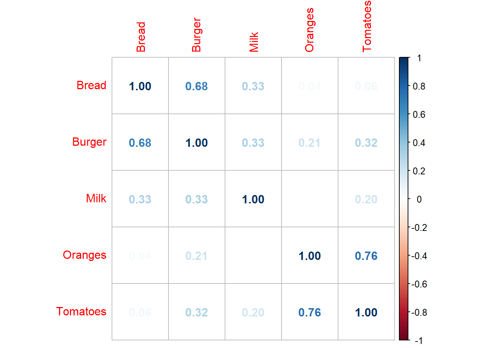


``` r
library(psych)
KMO(harga[,2:6])
#> Kaiser-Meyer-Olkin factor adequacy
#> Call: KMO(r = harga[, 2:6])
#> Overall MSA =  0.52
#> MSA for each item = 
#>    Bread   Burger     Milk  Oranges Tomatoes 
#>     0.52     0.58     0.59     0.49     0.48
```


``` r
# Bartlett's Test of Sphericity
cortest.bartlett(harga[,2:6])
#> R was not square, finding R from data
#> $chisq
#> [1] 36.46285
#> 
#> $p.value
#> [1] 7.006877e-05
#> 
#> $df
#> [1] 10
```


``` r
# Anti image correlation (AIC)
corrplot(KMO(harga[,2:6])$ImCo, method="number") 
```

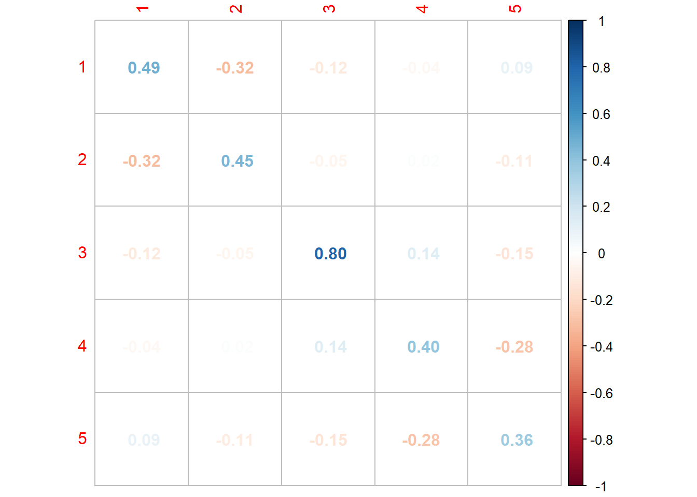


``` r
# Determinan positif
det(cor(harga[,2:6]))
#> [1] 0.1541406
```


``` r
# Principal component analysis (PCA)
pca1 = princomp(harga[,2:6], scores=TRUE, cor=TRUE)
summary(pca1)
#> Importance of components:
#>                           Comp.1    Comp.2    Comp.3
#> Standard deviation     1.4841538 1.2325047 0.8824610
#> Proportion of Variance 0.4405425 0.3038136 0.1557475
#> Cumulative Proportion  0.4405425 0.7443561 0.9001036
#>                            Comp.4     Comp.5
#> Standard deviation     0.55357732 0.43935672
#> Proportion of Variance 0.06128957 0.03860687
#> Cumulative Proportion  0.96139313 1.00000000
```


``` r
scree(harga[,2:6])
```

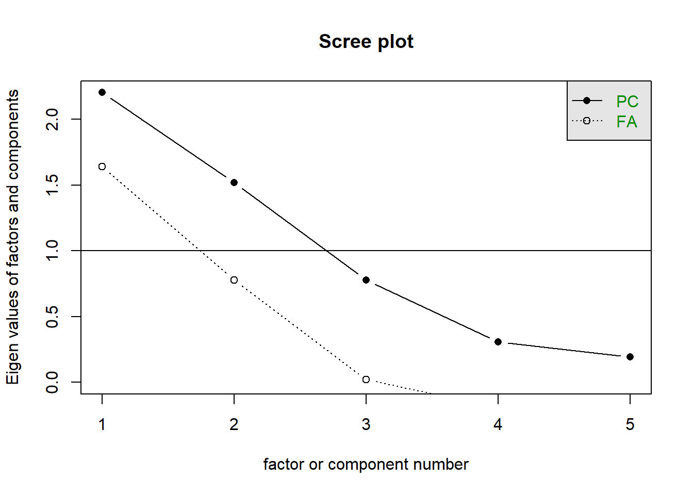


``` r
# Menentukan faktor loading Analisis faktor loading
loadings(pca1)
#> 
#> Loadings:
#>          Comp.1 Comp.2 Comp.3 Comp.4 Comp.5
#> Bread     0.436  0.484  0.354  0.597  0.306
#> Burger    0.542  0.292  0.307 -0.657 -0.309
#> Milk      0.346  0.308 -0.866        -0.163
#> Oranges   0.410 -0.579  0.108  0.399 -0.571
#> Tomatoes  0.478 -0.500 -0.137 -0.211  0.677
#> 
#>                Comp.1 Comp.2 Comp.3 Comp.4 Comp.5
#> SS loadings       1.0    1.0    1.0    1.0    1.0
#> Proportion Var    0.2    0.2    0.2    0.2    0.2
#> Cumulative Var    0.2    0.4    0.6    0.8    1.0
```


``` r
# Rotasi untuk mengkonfirmasi hasil analisis loading
fa1 = factanal(harga[,2:6], factor=2, rotation="varimax")
fa1
#> 
#> Call:
#> factanal(x = harga[, 2:6], factors = 2, rotation = "varimax")
#> 
#> Uniquenesses:
#>    Bread   Burger     Milk  Oranges Tomatoes 
#>    0.239    0.318    0.830    0.420    0.005 
#> 
#> Loadings:
#>          Factor1 Factor2
#> Bread             0.868 
#> Burger    0.195   0.803 
#> Milk      0.135   0.390 
#> Oranges   0.756         
#> Tomatoes  0.985   0.157 
#> 
#>                Factor1 Factor2
#> SS loadings      1.605   1.583
#> Proportion Var   0.321   0.317
#> Cumulative Var   0.321   0.638
#> 
#> Test of the hypothesis that 2 factors are sufficient.
#> The chi square statistic is 1.16 on 1 degree of freedom.
#> The p-value is 0.282
```


``` r
# Diagram jalur hasil analisis EFA dan menampilkan faktor loading-nya
fa.diagram(fa1$loadings, digits = 3)
```

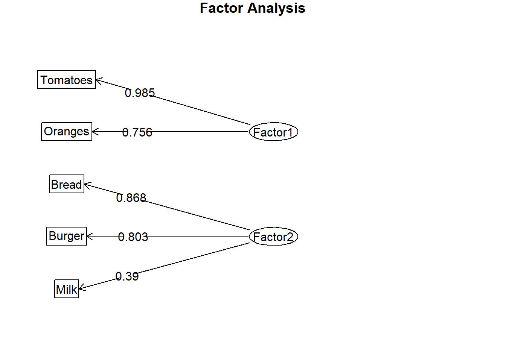

### CFA


``` r
# Spesifikasi model
attach(harga)
model1 <- "
F1 =~ Tomatoes + Oranges
F2 =~ Bread + Burger + Milk
F1 ~~ F2 "
```


``` r
library(lavaan)
#> Warning: package 'lavaan' was built under R version 4.4.3
#> This is lavaan 0.6-19
#> lavaan is FREE software! Please report any bugs.
#> 
#> Attaching package: 'lavaan'
#> The following object is masked from 'package:psych':
#> 
#>     cor2cov
fitmod = cfa(model1, data = harga)
#> Warning: lavaan->lav_object_post_check():  
#>    some estimated ov variances are negative
summary(fitmod, fit.measures = TRUE, standardized = TRUE)
#> lavaan 0.6-19 ended normally after 85 iterations
#> 
#>   Estimator                                         ML
#>   Optimization method                           NLMINB
#>   Number of model parameters                        11
#> 
#>   Number of observations                            23
#> 
#> Model Test User Model:
#>                                                       
#>   Test statistic                                 3.642
#>   Degrees of freedom                                 4
#>   P-value (Chi-square)                           0.457
#> 
#> Model Test Baseline Model:
#> 
#>   Test statistic                                43.007
#>   Degrees of freedom                                10
#>   P-value                                        0.000
#> 
#> User Model versus Baseline Model:
#> 
#>   Comparative Fit Index (CFI)                    1.000
#>   Tucker-Lewis Index (TLI)                       1.027
#> 
#> Loglikelihood and Information Criteria:
#> 
#>   Loglikelihood user model (H0)               -367.812
#>   Loglikelihood unrestricted model (H1)       -365.991
#>                                                       
#>   Akaike (AIC)                                 757.623
#>   Bayesian (BIC)                               770.114
#>   Sample-size adjusted Bayesian (SABIC)        736.072
#> 
#> Root Mean Square Error of Approximation:
#> 
#>   RMSEA                                          0.000
#>   90 Percent confidence interval - lower         0.000
#>   90 Percent confidence interval - upper         0.302
#>   P-value H_0: RMSEA <= 0.050                    0.487
#>   P-value H_0: RMSEA >= 0.080                    0.469
#> 
#> Standardized Root Mean Square Residual:
#> 
#>   SRMR                                           0.065
#> 
#> Parameter Estimates:
#> 
#>   Standard errors                             Standard
#>   Information                                 Expected
#>   Information saturated (h1) model          Structured
#> 
#> Latent Variables:
#>                    Estimate  Std.Err  z-value  P(>|z|)
#>   F1 =~                                               
#>     Tomatoes          1.000                           
#>     Oranges           0.934    0.580    1.611    0.107
#>   F2 =~                                               
#>     Bread             1.000                           
#>     Burger            4.700    2.464    1.907    0.056
#>     Milk              1.307    0.858    1.523    0.128
#>    Std.lv  Std.all
#>                   
#>    10.659    1.062
#>     9.952    0.715
#>                   
#>     1.622    0.662
#>     7.623    1.032
#>     2.119    0.312
#> 
#> Covariances:
#>                    Estimate  Std.Err  z-value  P(>|z|)
#>   F1 ~~                                               
#>     F2                5.161    4.482    1.151    0.250
#>    Std.lv  Std.all
#>                   
#>     0.299    0.299
#> 
#> Variances:
#>                    Estimate  Std.Err  z-value  P(>|z|)
#>    .Tomatoes        -12.966   66.742   -0.194    0.846
#>    .Oranges          94.906   64.476    1.472    0.141
#>    .Bread             3.381    1.581    2.138    0.033
#>    .Burger           -3.518   27.199   -0.129    0.897
#>    .Milk             41.714   12.439    3.354    0.001
#>     F1              113.605   72.842    1.560    0.119
#>     F2                2.631    1.912    1.376    0.169
#>    Std.lv  Std.all
#>   -12.966   -0.129
#>    94.906    0.489
#>     3.381    0.562
#>    -3.518   -0.064
#>    41.714    0.903
#>     1.000    1.000
#>     1.000    1.000
```


``` r
fitmeasures(fitmod)
#>                  npar                  fmin 
#>                11.000                 0.079 
#>                 chisq                    df 
#>                 3.642                 4.000 
#>                pvalue        baseline.chisq 
#>                 0.457                43.007 
#>           baseline.df       baseline.pvalue 
#>                10.000                 0.000 
#>                   cfi                   tli 
#>                 1.000                 1.027 
#>                  nnfi                   rfi 
#>                 1.027                 0.788 
#>                   nfi                  pnfi 
#>                 0.915                 0.366 
#>                   ifi                   rni 
#>                 1.009                 1.011 
#>                  logl     unrestricted.logl 
#>              -367.812              -365.991 
#>                   aic                   bic 
#>               757.623               770.114 
#>                ntotal                  bic2 
#>                23.000               736.072 
#>                 rmsea        rmsea.ci.lower 
#>                 0.000                 0.000 
#>        rmsea.ci.upper        rmsea.ci.level 
#>                 0.302                 0.900 
#>          rmsea.pvalue        rmsea.close.h0 
#>                 0.487                 0.050 
#> rmsea.notclose.pvalue     rmsea.notclose.h0 
#>                 0.469                 0.080 
#>                   rmr            rmr_nomean 
#>                 2.823                 2.823 
#>                  srmr          srmr_bentler 
#>                 0.065                 0.065 
#>   srmr_bentler_nomean                  crmr 
#>                 0.065                 0.080 
#>           crmr_nomean            srmr_mplus 
#>                 0.080                 0.065 
#>     srmr_mplus_nomean                 cn_05 
#>                 0.065                60.915 
#>                 cn_01                   gfi 
#>                84.843                 0.947 
#>                  agfi                  pgfi 
#>                 0.803                 0.253 
#>                   mfi                  ecvi 
#>                 1.008                 1.115
```


``` r
library(semPlot)
#> Warning: package 'semPlot' was built under R version 4.4.3
semPaths(fitmod, what='std', layout='tree', title = TRUE, 
         posCol = 1, nDigits = 3, 
         edge.label.cex=0.7, 
         exoVar = FALSE, 
         sizeMan = 5, 
         sizeLat = 5)
```

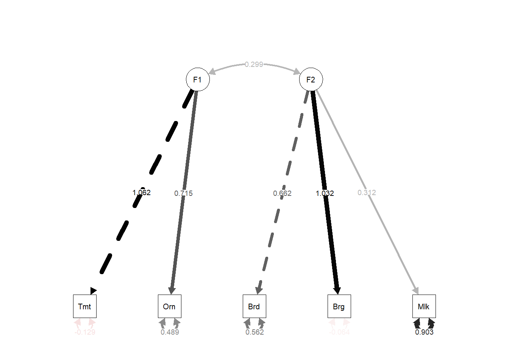


``` r
# Estimasi Reliabilitas alpha cronbach
psych::alpha(harga[,2:6])
#> Number of categories should be increased  in order to count frequencies.
#> 
#> Reliability analysis   
#> Call: psych::alpha(x = harga[, 2:6])
#> 
#>   raw_alpha std.alpha G6(smc) average_r S/N ase mean  sd
#>       0.63      0.67    0.77      0.29 2.1 0.1   67 5.8
#>  median_r
#>      0.26
#> 
#>     95% confidence boundaries 
#>          lower alpha upper
#> Feldt     0.32  0.63  0.82
#> Duhachek  0.42  0.63  0.83
#> 
#>  Reliability if an item is dropped:
#>          raw_alpha std.alpha G6(smc) average_r S/N alpha se
#> Bread         0.64      0.63    0.68      0.30 1.7    0.110
#> Burger        0.56      0.54    0.63      0.23 1.2    0.107
#> Milk          0.64      0.68    0.78      0.34 2.1    0.091
#> Oranges       0.55      0.65    0.66      0.32 1.9    0.140
#> Tomatoes      0.37      0.59    0.61      0.26 1.4    0.197
#>          var.r med.r
#> Bread    0.065  0.26
#> Burger   0.083  0.13
#> Milk     0.096  0.26
#> Oranges  0.043  0.32
#> Tomatoes 0.062  0.27
#> 
#>  Item statistics 
#>           n raw.r std.r r.cor r.drop mean   sd
#> Bread    23  0.38  0.64  0.56   0.30   25  2.5
#> Burger   23  0.62  0.77  0.72   0.41   92  7.6
#> Milk     23  0.42  0.56  0.36   0.20   62  7.0
#> Oranges  23  0.82  0.61  0.56   0.49  103 14.2
#> Tomatoes 23  0.86  0.71  0.68   0.71   52 10.3
```

## Model Persamaan Struktural (SEM)


``` r
library(lavaan)  
library(semPlot)
```


``` r
library(readxl)
datasem <- read_excel("Data/Datalikert.xlsx")
head(datasem[,1:5])
#> # A tibble: 6 × 5
#>   Perusahaan Provinsi   Pulau    A1    A2
#>        <dbl> <chr>      <chr> <dbl> <dbl>
#> 1          1 Jawa Barat Jawa      4     5
#> 2          2 Jawa Timur Jawa      5     5
#> 3          3 Jawa Timur Jawa      4     4
#> 4          4 Jawa Barat Jawa      4     4
#> 5          5 Jawa Timur Jawa      4     4
#> 6          6 Jawa Timur Jawa      4     4
```


``` r
str(datasem)
#> tibble [300 × 45] (S3: tbl_df/tbl/data.frame)
#>  $ Perusahaan: num [1:300] 1 2 3 4 5 6 7 8 9 10 ...
#>  $ Provinsi  : chr [1:300] "Jawa Barat" "Jawa Timur" "Jawa Timur" "Jawa Barat" ...
#>  $ Pulau     : chr [1:300] "Jawa" "Jawa" "Jawa" "Jawa" ...
#>  $ A1        : num [1:300] 4 5 4 4 4 4 4 5 4 5 ...
#>  $ A2        : num [1:300] 5 5 4 4 4 4 4 5 4 5 ...
#>  $ A3        : num [1:300] 5 5 4 3 4 5 4 5 3 5 ...
#>  $ A4        : num [1:300] 4 5 4 4 3 4 4 5 3 5 ...
#>  $ A5        : num [1:300] 4 4 4 4 4 4 4 5 3 5 ...
#>  $ A6        : num [1:300] 4 5 4 4 4 4 4 5 3 4 ...
#>  $ A7        : num [1:300] 5 5 5 4 4 4 4 5 3 5 ...
#>  $ A8        : num [1:300] 5 5 5 4 4 4 4 5 3 4 ...
#>  $ Atotal    : num [1:300] 36 39 34 31 31 33 32 40 26 38 ...
#>  $ B1        : num [1:300] 4 4 4 4 3 5 3 3 3 4 ...
#>  $ B2        : num [1:300] 4 4 4 3 4 4 3 3 2 4 ...
#>  $ Btotal    : num [1:300] 8 8 8 7 7 9 6 6 5 8 ...
#>  $ C1        : num [1:300] 4 4 4 4 4 4 4 5 3 4 ...
#>  $ C2        : num [1:300] 4 4 4 4 4 4 4 4 3 4 ...
#>  $ Ctotal    : num [1:300] 8 8 8 8 8 8 8 9 6 8 ...
#>  $ D1        : num [1:300] 4 5 4 4 4 4 4 4 3 4 ...
#>  $ D2        : num [1:300] 4 5 4 3 4 5 4 4 2 4 ...
#>  $ D3        : num [1:300] 4 5 4 4 4 4 4 4 3 4 ...
#>  $ D4        : num [1:300] 4 5 4 5 4 4 4 4 3 4 ...
#>  $ Dtotal    : num [1:300] 16 20 16 16 16 17 16 16 11 16 ...
#>  $ E1        : num [1:300] 5 5 4 4 4 4 4 4 3 5 ...
#>  $ E2        : num [1:300] 5 5 4 4 4 5 4 4 3 5 ...
#>  $ E3        : num [1:300] 5 5 4 4 4 5 4 5 4 5 ...
#>  $ E4        : num [1:300] 4 5 4 3 4 5 4 4 3 4 ...
#>  $ E5        : num [1:300] 4 5 4 4 3 5 4 4 3 4 ...
#>  $ E6        : num [1:300] 4 5 4 4 4 4 4 4 3 4 ...
#>  $ E7        : num [1:300] 4 5 4 4 4 5 4 4 3 4 ...
#>  $ E8        : num [1:300] 4 5 4 4 3 5 4 4 3 4 ...
#>  $ E9        : num [1:300] 4 5 4 4 4 4 4 4 3 4 ...
#>  $ E10       : num [1:300] 4 5 4 4 4 5 4 5 3 4 ...
#>  $ E11       : num [1:300] 4 5 4 3 3 5 4 5 3 4 ...
#>  $ E12       : num [1:300] 5 5 4 4 4 5 4 5 3 5 ...
#>  $ Etotal    : num [1:300] 52 60 48 46 45 57 48 52 37 52 ...
#>  $ F1        : num [1:300] 5 5 4 4 4 5 4 4 2 4 ...
#>  $ F2        : num [1:300] 4 5 4 4 4 5 4 4 3 3 ...
#>  $ F3        : num [1:300] 4 5 4 4 4 4 4 4 2 3 ...
#>  $ F4        : num [1:300] 4 5 4 4 4 5 4 5 3 4 ...
#>  $ F5        : num [1:300] 4 5 4 4 3 5 4 4 3 3 ...
#>  $ F6        : num [1:300] 4 5 4 4 3 4 4 5 3 4 ...
#>  $ F7        : num [1:300] 4 5 4 4 3 4 4 4 3 4 ...
#>  $ F8        : num [1:300] 4 5 4 4 4 5 4 4 3 4 ...
#>  $ Ftotal    : num [1:300] 33 40 32 32 29 37 32 34 22 29 ...
```


``` r
attach(datasem)
table(A1)
#> A1
#>   1   2   3   4   5 
#>   3   4  37 121 135
```


``` r
barplot(table(A1))
```

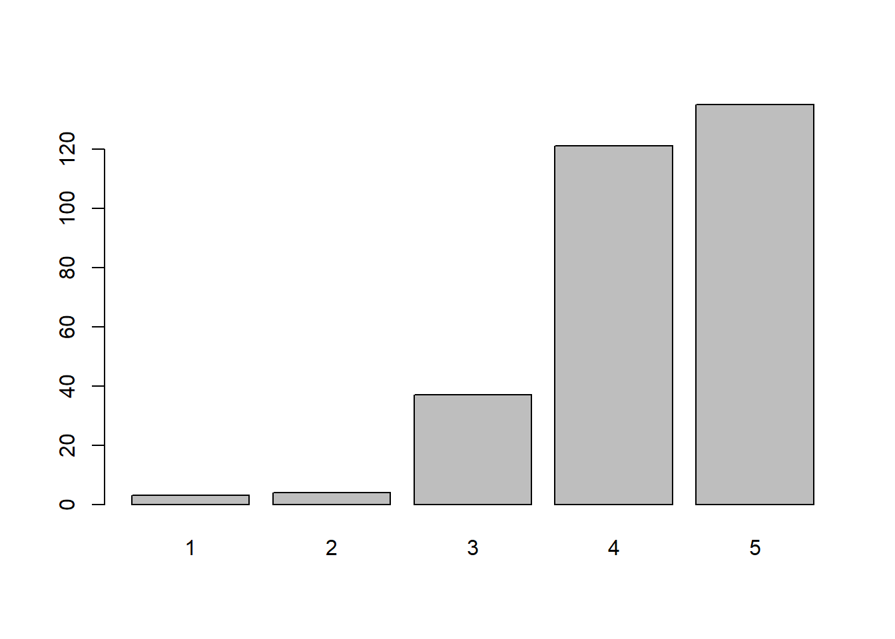


``` r
# Spesifikasi Model
sem.model = "
faktor =~ A1 + A2 + A3 + A4
permintaan =~ B1 + B2  
industri =~ C1 + C2  
strategi =~ D1 + D2 + D3 + D4
regulasi =~ E1 + E2 + E3 + E4 + E5 + E6
kesempatan =~ F1 + F2 + F3 + F4
kesempatan ~ faktor + permintaan + industri + strategi + regulasi"
```


``` r
sem.fit = sem(sem.model, data = datasem)
summary(sem.fit, fit.measures=TRUE)
#> lavaan 0.6-19 ended normally after 90 iterations
#> 
#>   Estimator                                         ML
#>   Optimization method                           NLMINB
#>   Number of model parameters                        59
#> 
#>   Number of observations                           300
#> 
#> Model Test User Model:
#>                                                       
#>   Test statistic                               555.757
#>   Degrees of freedom                               194
#>   P-value (Chi-square)                           0.000
#> 
#> Model Test Baseline Model:
#> 
#>   Test statistic                              7355.210
#>   Degrees of freedom                               231
#>   P-value                                        0.000
#> 
#> User Model versus Baseline Model:
#> 
#>   Comparative Fit Index (CFI)                    0.949
#>   Tucker-Lewis Index (TLI)                       0.940
#> 
#> Loglikelihood and Information Criteria:
#> 
#>   Loglikelihood user model (H0)              -4608.159
#>   Loglikelihood unrestricted model (H1)      -4330.280
#>                                                       
#>   Akaike (AIC)                                9334.318
#>   Bayesian (BIC)                              9552.841
#>   Sample-size adjusted Bayesian (SABIC)       9365.728
#> 
#> Root Mean Square Error of Approximation:
#> 
#>   RMSEA                                          0.079
#>   90 Percent confidence interval - lower         0.071
#>   90 Percent confidence interval - upper         0.087
#>   P-value H_0: RMSEA <= 0.050                    0.000
#>   P-value H_0: RMSEA >= 0.080                    0.410
#> 
#> Standardized Root Mean Square Residual:
#> 
#>   SRMR                                           0.035
#> 
#> Parameter Estimates:
#> 
#>   Standard errors                             Standard
#>   Information                                 Expected
#>   Information saturated (h1) model          Structured
#> 
#> Latent Variables:
#>                    Estimate  Std.Err  z-value  P(>|z|)
#>   faktor =~                                           
#>     A1                1.000                           
#>     A2                1.266    0.089   14.271    0.000
#>     A3                1.312    0.094   13.991    0.000
#>     A4                1.261    0.091   13.913    0.000
#>   permintaan =~                                       
#>     B1                1.000                           
#>     B2                1.020    0.063   16.072    0.000
#>   industri =~                                         
#>     C1                1.000                           
#>     C2                1.035    0.044   23.446    0.000
#>   strategi =~                                         
#>     D1                1.000                           
#>     D2                0.973    0.033   29.472    0.000
#>     D3                0.972    0.043   22.590    0.000
#>     D4                0.817    0.042   19.325    0.000
#>   regulasi =~                                         
#>     E1                1.000                           
#>     E2                0.929    0.039   23.666    0.000
#>     E3                0.950    0.043   22.088    0.000
#>     E4                1.015    0.039   25.697    0.000
#>     E5                0.985    0.042   23.464    0.000
#>     E6                0.913    0.045   20.186    0.000
#>   kesempatan =~                                       
#>     F1                1.000                           
#>     F2                1.006    0.038   26.712    0.000
#>     F3                1.033    0.042   24.672    0.000
#>     F4                0.943    0.046   20.414    0.000
#> 
#> Regressions:
#>                    Estimate  Std.Err  z-value  P(>|z|)
#>   kesempatan ~                                        
#>     faktor            0.016    0.111    0.146    0.884
#>     permintaan        0.042    0.059    0.705    0.481
#>     industri          0.129    0.133    0.976    0.329
#>     strategi          0.131    0.091    1.449    0.147
#>     regulasi          0.685    0.077    8.860    0.000
#> 
#> Covariances:
#>                    Estimate  Std.Err  z-value  P(>|z|)
#>   faktor ~~                                           
#>     permintaan        0.233    0.034    6.785    0.000
#>     industri          0.327    0.037    8.729    0.000
#>     strategi          0.292    0.035    8.242    0.000
#>     regulasi          0.343    0.039    8.730    0.000
#>   permintaan ~~                                       
#>     industri          0.366    0.043    8.447    0.000
#>     strategi          0.391    0.045    8.713    0.000
#>     regulasi          0.332    0.043    7.797    0.000
#>   industri ~~                                         
#>     strategi          0.437    0.043   10.274    0.000
#>     regulasi          0.416    0.043    9.764    0.000
#>   strategi ~~                                         
#>     regulasi          0.405    0.042    9.580    0.000
#> 
#> Variances:
#>                    Estimate  Std.Err  z-value  P(>|z|)
#>    .A1                0.323    0.029   11.229    0.000
#>    .A2                0.161    0.018    8.902    0.000
#>    .A3                0.205    0.022    9.430    0.000
#>    .A4                0.198    0.021    9.552    0.000
#>    .B1                0.269    0.032    8.457    0.000
#>    .B2                0.078    0.025    3.161    0.002
#>    .C1                0.122    0.014    8.515    0.000
#>    .C2                0.106    0.014    7.549    0.000
#>    .D1                0.093    0.011    8.749    0.000
#>    .D2                0.063    0.008    7.476    0.000
#>    .D3                0.182    0.017   10.625    0.000
#>    .D4                0.200    0.018   11.219    0.000
#>    .E1                0.145    0.014   10.563    0.000
#>    .E2                0.114    0.011   10.395    0.000
#>    .E3                0.156    0.014   10.845    0.000
#>    .E4                0.091    0.010    9.488    0.000
#>    .E5                0.133    0.013   10.462    0.000
#>    .E6                0.198    0.018   11.224    0.000
#>    .F1                0.139    0.014    9.697    0.000
#>    .F2                0.090    0.011    8.221    0.000
#>    .F3                0.140    0.015    9.540    0.000
#>    .F4                0.233    0.021   10.912    0.000
#>     faktor            0.321    0.047    6.841    0.000
#>     permintaan        0.525    0.065    8.048    0.000
#>     industri          0.480    0.049    9.751    0.000
#>     strategi          0.522    0.050   10.406    0.000
#>     regulasi          0.542    0.055    9.811    0.000
#>    .kesempatan        0.122    0.015    8.068    0.000
```


``` r
sem.fit = sem(sem.model, data = datasem, std.lv=TRUE)
summary(sem.fit, fit.measures=TRUE, standardized=TRUE)
#> lavaan 0.6-19 ended normally after 90 iterations
#> 
#>   Estimator                                         ML
#>   Optimization method                           NLMINB
#>   Number of model parameters                        59
#> 
#>   Number of observations                           300
#> 
#> Model Test User Model:
#>                                                       
#>   Test statistic                               555.757
#>   Degrees of freedom                               194
#>   P-value (Chi-square)                           0.000
#> 
#> Model Test Baseline Model:
#> 
#>   Test statistic                              7355.210
#>   Degrees of freedom                               231
#>   P-value                                        0.000
#> 
#> User Model versus Baseline Model:
#> 
#>   Comparative Fit Index (CFI)                    0.949
#>   Tucker-Lewis Index (TLI)                       0.940
#> 
#> Loglikelihood and Information Criteria:
#> 
#>   Loglikelihood user model (H0)              -4608.159
#>   Loglikelihood unrestricted model (H1)      -4330.280
#>                                                       
#>   Akaike (AIC)                                9334.318
#>   Bayesian (BIC)                              9552.841
#>   Sample-size adjusted Bayesian (SABIC)       9365.728
#> 
#> Root Mean Square Error of Approximation:
#> 
#>   RMSEA                                          0.079
#>   90 Percent confidence interval - lower         0.071
#>   90 Percent confidence interval - upper         0.087
#>   P-value H_0: RMSEA <= 0.050                    0.000
#>   P-value H_0: RMSEA >= 0.080                    0.410
#> 
#> Standardized Root Mean Square Residual:
#> 
#>   SRMR                                           0.035
#> 
#> Parameter Estimates:
#> 
#>   Standard errors                             Standard
#>   Information                                 Expected
#>   Information saturated (h1) model          Structured
#> 
#> Latent Variables:
#>                    Estimate  Std.Err  z-value  P(>|z|)
#>   faktor =~                                           
#>     A1                0.566    0.041   13.681    0.000
#>     A2                0.717    0.038   18.699    0.000
#>     A3                0.743    0.041   18.064    0.000
#>     A4                0.714    0.040   17.894    0.000
#>   permintaan =~                                       
#>     B1                0.725    0.045   16.097    0.000
#>     B2                0.739    0.038   19.509    0.000
#>   industri =~                                         
#>     C1                0.692    0.036   19.503    0.000
#>     C2                0.717    0.036   20.132    0.000
#>   strategi =~                                         
#>     D1                0.723    0.035   20.812    0.000
#>     D2                0.703    0.033   21.615    0.000
#>     D3                0.702    0.038   18.344    0.000
#>     D4                0.590    0.036   16.459    0.000
#>   regulasi =~                                         
#>     E1                0.736    0.038   19.623    0.000
#>     E2                0.684    0.034   19.941    0.000
#>     E3                0.699    0.037   18.967    0.000
#>     E4                0.747    0.035   21.120    0.000
#>     E5                0.725    0.037   19.819    0.000
#>     E6                0.673    0.038   17.720    0.000
#>   kesempatan =~                                       
#>     F1                0.350    0.022   16.135    0.000
#>     F2                0.352    0.021   16.722    0.000
#>     F3                0.361    0.022   16.227    0.000
#>     F4                0.330    0.022   14.833    0.000
#>    Std.lv  Std.all
#>                   
#>     0.566    0.706
#>     0.717    0.872
#>     0.743    0.854
#>     0.714    0.849
#>                   
#>     0.725    0.813
#>     0.739    0.935
#>                   
#>     0.692    0.893
#>     0.717    0.911
#>                   
#>     0.723    0.922
#>     0.703    0.941
#>     0.702    0.855
#>     0.590    0.797
#>                   
#>     0.736    0.888
#>     0.684    0.897
#>     0.699    0.870
#>     0.747    0.927
#>     0.725    0.894
#>     0.673    0.834
#>                   
#>     0.771    0.900
#>     0.776    0.933
#>     0.796    0.905
#>     0.727    0.833
#> 
#> Regressions:
#>                    Estimate  Std.Err  z-value  P(>|z|)
#>   kesempatan ~                                        
#>     faktor            0.026    0.180    0.146    0.884
#>     permintaan        0.086    0.123    0.705    0.481
#>     industri          0.256    0.263    0.973    0.331
#>     strategi          0.272    0.188    1.447    0.148
#>     regulasi          1.443    0.190    7.608    0.000
#>    Std.lv  Std.all
#>                   
#>     0.012    0.012
#>     0.039    0.039
#>     0.116    0.116
#>     0.123    0.123
#>     0.654    0.654
#> 
#> Covariances:
#>                    Estimate  Std.Err  z-value  P(>|z|)
#>   faktor ~~                                           
#>     permintaan        0.568    0.046   12.297    0.000
#>     industri          0.833    0.025   33.258    0.000
#>     strategi          0.715    0.033   21.548    0.000
#>     regulasi          0.822    0.023   35.175    0.000
#>   permintaan ~~                                       
#>     industri          0.729    0.035   20.610    0.000
#>     strategi          0.746    0.032   23.194    0.000
#>     regulasi          0.623    0.041   15.291    0.000
#>   industri ~~                                         
#>     strategi          0.874    0.020   44.744    0.000
#>     regulasi          0.816    0.024   33.446    0.000
#>   strategi ~~                                         
#>     regulasi          0.762    0.027   27.976    0.000
#>    Std.lv  Std.all
#>                   
#>     0.568    0.568
#>     0.833    0.833
#>     0.715    0.715
#>     0.822    0.822
#>                   
#>     0.729    0.729
#>     0.746    0.746
#>     0.623    0.623
#>                   
#>     0.874    0.874
#>     0.816    0.816
#>                   
#>     0.762    0.762
#> 
#> Variances:
#>                    Estimate  Std.Err  z-value  P(>|z|)
#>    .A1                0.323    0.029   11.229    0.000
#>    .A2                0.161    0.018    8.902    0.000
#>    .A3                0.205    0.022    9.430    0.000
#>    .A4                0.198    0.021    9.552    0.000
#>    .B1                0.269    0.032    8.457    0.000
#>    .B2                0.078    0.025    3.161    0.002
#>    .C1                0.122    0.014    8.515    0.000
#>    .C2                0.106    0.014    7.549    0.000
#>    .D1                0.093    0.011    8.749    0.000
#>    .D2                0.063    0.008    7.476    0.000
#>    .D3                0.182    0.017   10.625    0.000
#>    .D4                0.200    0.018   11.219    0.000
#>    .E1                0.145    0.014   10.563    0.000
#>    .E2                0.114    0.011   10.395    0.000
#>    .E3                0.156    0.014   10.845    0.000
#>    .E4                0.091    0.010    9.488    0.000
#>    .E5                0.133    0.013   10.462    0.000
#>    .E6                0.198    0.018   11.224    0.000
#>    .F1                0.139    0.014    9.697    0.000
#>    .F2                0.090    0.011    8.221    0.000
#>    .F3                0.140    0.015    9.540    0.000
#>    .F4                0.233    0.021   10.912    0.000
#>     faktor            1.000                           
#>     permintaan        1.000                           
#>     industri          1.000                           
#>     strategi          1.000                           
#>     regulasi          1.000                           
#>    .kesempatan        1.000                           
#>    Std.lv  Std.all
#>     0.323    0.502
#>     0.161    0.239
#>     0.205    0.271
#>     0.198    0.280
#>     0.269    0.339
#>     0.078    0.126
#>     0.122    0.203
#>     0.106    0.171
#>     0.093    0.151
#>     0.063    0.114
#>     0.182    0.270
#>     0.200    0.365
#>     0.145    0.211
#>     0.114    0.195
#>     0.156    0.242
#>     0.091    0.141
#>     0.133    0.201
#>     0.198    0.304
#>     0.139    0.190
#>     0.090    0.130
#>     0.140    0.181
#>     0.233    0.306
#>     1.000    1.000
#>     1.000    1.000
#>     1.000    1.000
#>     1.000    1.000
#>     1.000    1.000
#>     0.206    0.206
```


``` r
#sem.fit = sem(sem.model, data = datasem, std.lv=TRUE, orthogonal=TRUE)
#summary(sem.fit, fit.measures=TRUE, standardized=TRUE)
```


``` r
# Modification Indices
modificationIndices(sem.fit, minimum.value = 10)
#>            lhs op rhs     mi    epc sepc.lv sepc.all
#> 72      faktor =~  D3 10.792  0.143   0.143    0.174
#> 82      faktor =~  F3 14.022 -0.170  -0.170   -0.193
#> 99  permintaan =~  E6 13.919  0.142   0.142    0.176
#> 112   industri =~  D3 19.393  0.315   0.315    0.383
#> 134   strategi =~  E3 11.975 -0.144  -0.144   -0.179
#> 152   regulasi =~  D3 18.808  0.197   0.197    0.240
#> 157   regulasi =~  F4 13.142  0.272   0.272    0.312
#> 168 kesempatan =~  D3 22.896  0.100   0.220    0.268
#> 175 kesempatan =~  E6 25.214  0.153   0.337    0.418
#> 176         A1 ~~  A2 15.863  0.068   0.068    0.298
#> 270         B1 ~~  F4 14.265  0.063   0.063    0.253
#> 317         D1 ~~  D3 10.752 -0.035  -0.035   -0.272
#> 331         D2 ~~  E1 11.098  0.025   0.025    0.257
#> 347         D3 ~~  E6 12.029  0.042   0.042    0.223
#> 351         D3 ~~  F4 10.217 -0.043  -0.043   -0.208
#> 352         D4 ~~  E1 11.953 -0.038  -0.038   -0.223
#> 362         E1 ~~  E2 17.329  0.038   0.038    0.294
#> 363         E1 ~~  E3 10.360  0.033   0.033    0.220
#> 364         E1 ~~  E4 12.186 -0.031  -0.031   -0.266
#> 371         E2 ~~  E3 11.663  0.032   0.032    0.236
#> 373         E2 ~~  E5 10.449 -0.028  -0.028   -0.231
#> 381         E3 ~~  E6 11.439 -0.039  -0.039   -0.221
#> 386         E4 ~~  E5 25.380  0.043   0.043    0.388
#> 398         E6 ~~  F2 14.478 -0.037  -0.037   -0.275
#> 399         E6 ~~  F3 20.998  0.052   0.052    0.310
#> 405         F2 ~~  F4 24.019 -0.058  -0.058   -0.404
#> 406         F3 ~~  F4 14.294  0.050   0.050    0.279
#>     sepc.nox
#> 72     0.174
#> 82    -0.193
#> 99     0.176
#> 112    0.383
#> 134   -0.179
#> 152    0.240
#> 157    0.312
#> 168    0.268
#> 175    0.418
#> 176    0.298
#> 270    0.253
#> 317   -0.272
#> 331    0.257
#> 347    0.223
#> 351   -0.208
#> 352   -0.223
#> 362    0.294
#> 363    0.220
#> 364   -0.266
#> 371    0.236
#> 373   -0.231
#> 381   -0.221
#> 386    0.388
#> 398   -0.275
#> 399    0.310
#> 405   -0.404
#> 406    0.279
```


``` r
sem.model2 = "
faktor =~ A1 + A2 + A3 + A4
permintaan =~ B1 + B2  
industri =~ C1 + C2  
strategi =~ D1 + D2 + D3 + D4
regulasi =~ E1 + E2 + E3 + E4 + E5 + E6
kesempatan =~ F1 + F2 + F3 + F4
kesempatan ~ faktor + permintaan + industri + strategi + regulasi
A1	~~	A2
"
```


``` r
sem.fit = sem(sem.model2, data = datasem, std.lv=TRUE)
summary(sem.fit, fit.measures=TRUE, standardized=TRUE)
#> lavaan 0.6-19 ended normally after 94 iterations
#> 
#>   Estimator                                         ML
#>   Optimization method                           NLMINB
#>   Number of model parameters                        60
#> 
#>   Number of observations                           300
#> 
#> Model Test User Model:
#>                                                       
#>   Test statistic                               540.535
#>   Degrees of freedom                               193
#>   P-value (Chi-square)                           0.000
#> 
#> Model Test Baseline Model:
#> 
#>   Test statistic                              7355.210
#>   Degrees of freedom                               231
#>   P-value                                        0.000
#> 
#> User Model versus Baseline Model:
#> 
#>   Comparative Fit Index (CFI)                    0.951
#>   Tucker-Lewis Index (TLI)                       0.942
#> 
#> Loglikelihood and Information Criteria:
#> 
#>   Loglikelihood user model (H0)              -4600.548
#>   Loglikelihood unrestricted model (H1)      -4330.280
#>                                                       
#>   Akaike (AIC)                                9321.095
#>   Bayesian (BIC)                              9543.322
#>   Sample-size adjusted Bayesian (SABIC)       9353.038
#> 
#> Root Mean Square Error of Approximation:
#> 
#>   RMSEA                                          0.077
#>   90 Percent confidence interval - lower         0.070
#>   90 Percent confidence interval - upper         0.085
#>   P-value H_0: RMSEA <= 0.050                    0.000
#>   P-value H_0: RMSEA >= 0.080                    0.303
#> 
#> Standardized Root Mean Square Residual:
#> 
#>   SRMR                                           0.035
#> 
#> Parameter Estimates:
#> 
#>   Standard errors                             Standard
#>   Information                                 Expected
#>   Information saturated (h1) model          Structured
#> 
#> Latent Variables:
#>                    Estimate  Std.Err  z-value  P(>|z|)
#>   faktor =~                                           
#>     A1                0.539    0.043   12.660    0.000
#>     A2                0.702    0.039   18.009    0.000
#>     A3                0.752    0.041   18.363    0.000
#>     A4                0.720    0.040   18.060    0.000
#>   permintaan =~                                       
#>     B1                0.724    0.045   16.093    0.000
#>     B2                0.739    0.038   19.507    0.000
#>   industri =~                                         
#>     C1                0.692    0.036   19.469    0.000
#>     C2                0.717    0.036   20.171    0.000
#>   strategi =~                                         
#>     D1                0.723    0.035   20.813    0.000
#>     D2                0.703    0.033   21.613    0.000
#>     D3                0.702    0.038   18.345    0.000
#>     D4                0.590    0.036   16.460    0.000
#>   regulasi =~                                         
#>     E1                0.736    0.038   19.615    0.000
#>     E2                0.684    0.034   19.943    0.000
#>     E3                0.699    0.037   18.964    0.000
#>     E4                0.747    0.035   21.115    0.000
#>     E5                0.726    0.037   19.826    0.000
#>     E6                0.673    0.038   17.728    0.000
#>   kesempatan =~                                       
#>     F1                0.350    0.022   16.137    0.000
#>     F2                0.352    0.021   16.726    0.000
#>     F3                0.361    0.022   16.232    0.000
#>     F4                0.330    0.022   14.836    0.000
#>    Std.lv  Std.all
#>                   
#>     0.539    0.672
#>     0.702    0.854
#>     0.752    0.864
#>     0.720    0.855
#>                   
#>     0.724    0.813
#>     0.739    0.935
#>                   
#>     0.692    0.892
#>     0.717    0.912
#>                   
#>     0.723    0.922
#>     0.703    0.941
#>     0.702    0.855
#>     0.590    0.797
#>                   
#>     0.736    0.888
#>     0.684    0.897
#>     0.699    0.870
#>     0.747    0.927
#>     0.726    0.894
#>     0.673    0.834
#>                   
#>     0.771    0.900
#>     0.776    0.933
#>     0.796    0.905
#>     0.727    0.833
#> 
#> Regressions:
#>                    Estimate  Std.Err  z-value  P(>|z|)
#>   kesempatan ~                                        
#>     faktor            0.031    0.186    0.167    0.867
#>     permintaan        0.087    0.122    0.709    0.478
#>     industri          0.253    0.267    0.947    0.344
#>     strategi          0.272    0.189    1.442    0.149
#>     regulasi          1.441    0.190    7.578    0.000
#>    Std.lv  Std.all
#>                   
#>     0.014    0.014
#>     0.039    0.039
#>     0.115    0.115
#>     0.123    0.123
#>     0.654    0.654
#> 
#> Covariances:
#>                    Estimate  Std.Err  z-value  P(>|z|)
#>  .A1 ~~                                               
#>    .A2                0.068    0.019    3.588    0.000
#>   faktor ~~                                           
#>     permintaan        0.573    0.046   12.417    0.000
#>     industri          0.837    0.025   33.458    0.000
#>     strategi          0.716    0.033   21.421    0.000
#>     regulasi          0.824    0.024   34.919    0.000
#>   permintaan ~~                                       
#>     industri          0.729    0.035   20.581    0.000
#>     strategi          0.746    0.032   23.189    0.000
#>     regulasi          0.623    0.041   15.292    0.000
#>   industri ~~                                         
#>     strategi          0.874    0.020   44.757    0.000
#>     regulasi          0.816    0.024   33.429    0.000
#>   strategi ~~                                         
#>     regulasi          0.762    0.027   27.982    0.000
#>    Std.lv  Std.all
#>                   
#>     0.068    0.269
#>                   
#>     0.573    0.573
#>     0.837    0.837
#>     0.716    0.716
#>     0.824    0.824
#>                   
#>     0.729    0.729
#>     0.746    0.746
#>     0.623    0.623
#>                   
#>     0.874    0.874
#>     0.816    0.816
#>                   
#>     0.762    0.762
#> 
#> Variances:
#>                    Estimate  Std.Err  z-value  P(>|z|)
#>    .A1                0.353    0.032   11.133    0.000
#>    .A2                0.182    0.020    9.132    0.000
#>    .A3                0.192    0.022    8.905    0.000
#>    .A4                0.190    0.021    9.171    0.000
#>    .B1                0.270    0.032    8.454    0.000
#>    .B2                0.078    0.025    3.155    0.002
#>    .C1                0.123    0.014    8.573    0.000
#>    .C2                0.104    0.014    7.494    0.000
#>    .D1                0.093    0.011    8.748    0.000
#>    .D2                0.063    0.008    7.481    0.000
#>    .D3                0.182    0.017   10.624    0.000
#>    .D4                0.200    0.018   11.218    0.000
#>    .E1                0.145    0.014   10.565    0.000
#>    .E2                0.114    0.011   10.392    0.000
#>    .E3                0.157    0.014   10.844    0.000
#>    .E4                0.092    0.010    9.490    0.000
#>    .E5                0.132    0.013   10.456    0.000
#>    .E6                0.197    0.018   11.222    0.000
#>    .F1                0.140    0.014    9.700    0.000
#>    .F2                0.090    0.011    8.219    0.000
#>    .F3                0.140    0.015    9.538    0.000
#>    .F4                0.233    0.021   10.912    0.000
#>     faktor            1.000                           
#>     permintaan        1.000                           
#>     industri          1.000                           
#>     strategi          1.000                           
#>     regulasi          1.000                           
#>    .kesempatan        1.000                           
#>    Std.lv  Std.all
#>     0.353    0.549
#>     0.182    0.270
#>     0.192    0.253
#>     0.190    0.268
#>     0.270    0.339
#>     0.078    0.125
#>     0.123    0.205
#>     0.104    0.169
#>     0.093    0.151
#>     0.063    0.114
#>     0.182    0.270
#>     0.200    0.365
#>     0.145    0.211
#>     0.114    0.195
#>     0.157    0.242
#>     0.092    0.141
#>     0.132    0.201
#>     0.197    0.304
#>     0.140    0.190
#>     0.090    0.130
#>     0.140    0.181
#>     0.233    0.306
#>     1.000    1.000
#>     1.000    1.000
#>     1.000    1.000
#>     1.000    1.000
#>     1.000    1.000
#>     0.206    0.206
```

### Visualisasi SEM


``` r
semPaths(sem.fit)
```

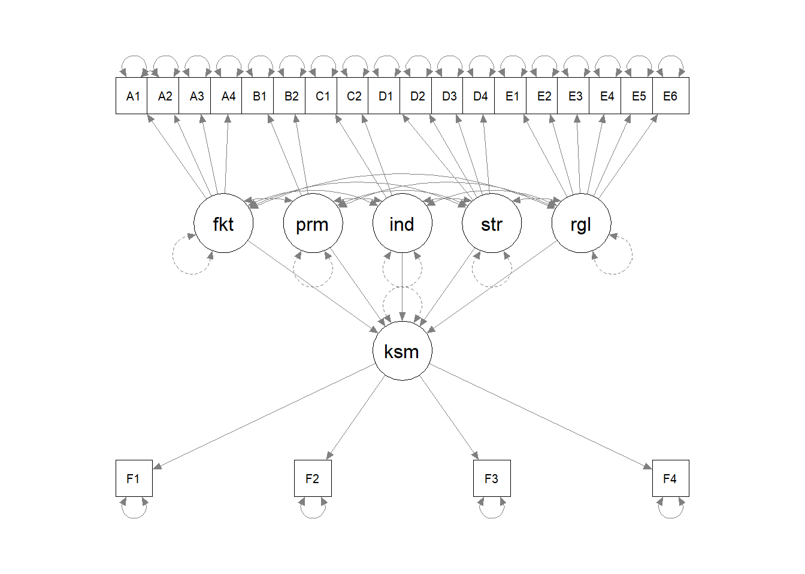


``` r
semPaths(sem.fit, "std", 
         color = list(lat = "green", man = "yellow"), 
         edge.color="black")
```

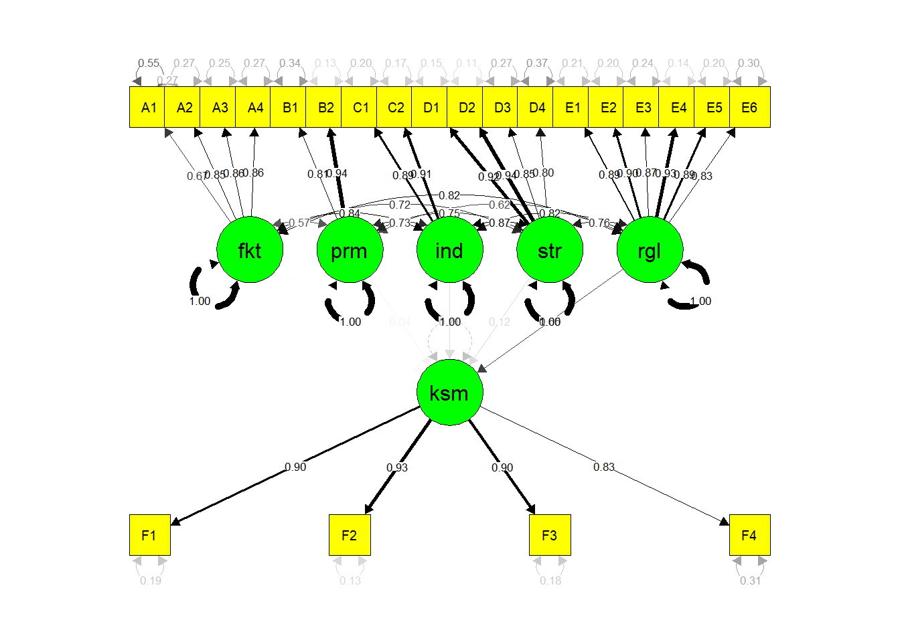


``` r
semPaths(sem.fit, "std", 
         color = list(lat = "green", man = "yellow"), 
         edge.color="black", fade=FALSE)
```

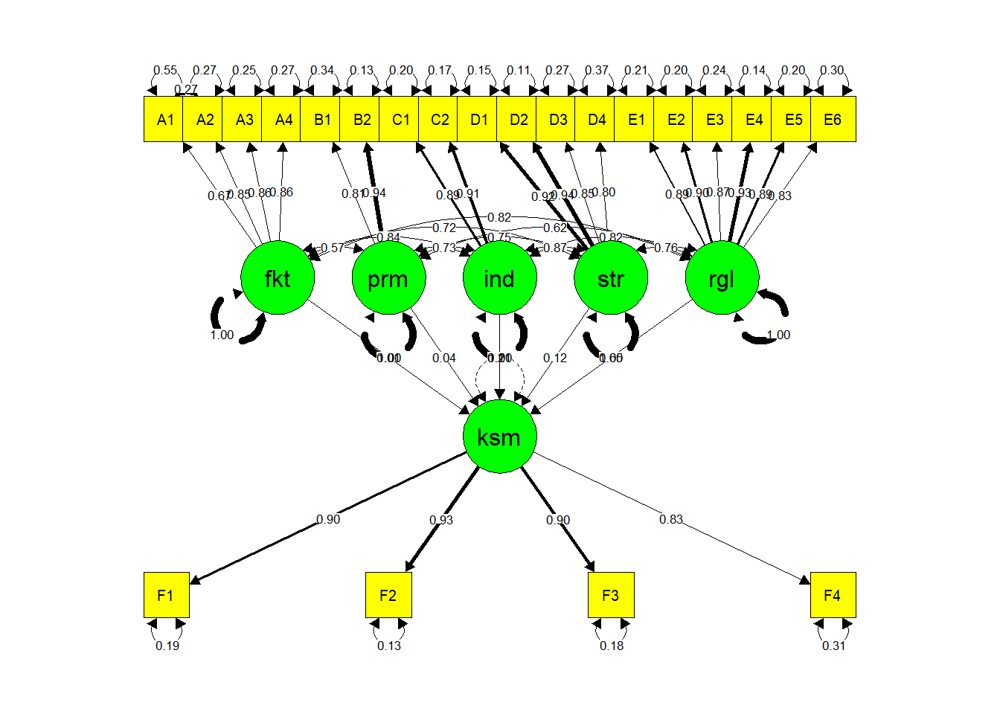


``` r
semPaths(sem.fit, "std", 
         color = list(lat = "green", man = "yellow"), 
         edge.color="black", 
         fade=FALSE, residuals=FALSE, exoCov=FALSE)
```

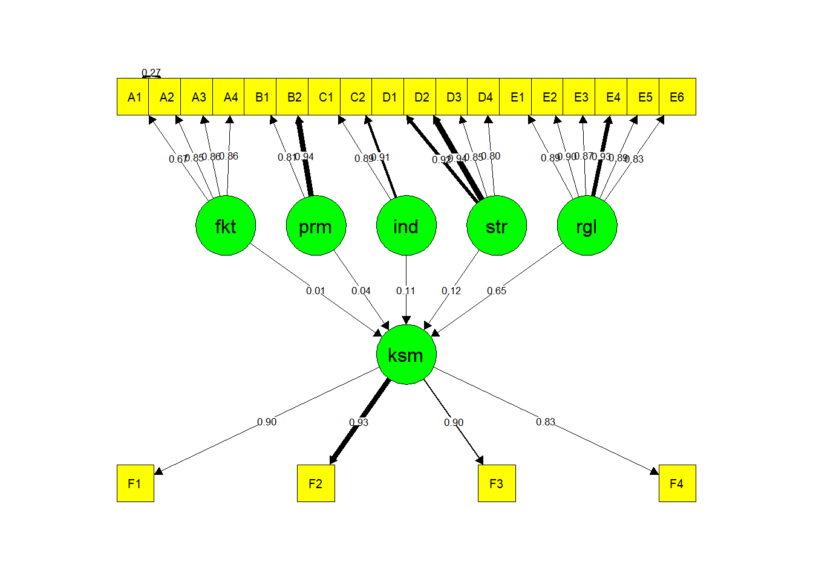

## PLS SEM


``` r
# source:https://rpubs.com/ifn1411/PLS
# install plspm
#install.packages("plspm")
# load plspm
library(plspm)
#> Warning: package 'plspm' was built under R version 4.4.3
#> 
#> Attaching package: 'plspm'
#> The following objects are masked from 'package:psych':
#> 
#>     alpha, rescale, unidim
```


``` r
# load data spainmodel
data(spainfoot)
# first 5 row of spainmodel data
head(spainfoot)
#>            GSH GSA  SSH  SSA GCH GCA  CSH  CSA WMH WMA LWR
#> Barcelona   61  44 0.95 0.95  14  21 0.47 0.32  14  13  10
#> RealMadrid  49  34 1.00 0.84  29  23 0.37 0.37  14  11  10
#> Sevilla     28  26 0.74 0.74  20  19 0.42 0.53  11  10   4
#> AtleMadrid  47  33 0.95 0.84  23  34 0.37 0.16  13   7   6
#> Villarreal  33  28 0.84 0.68  25  29 0.26 0.16  12   6   5
#> Valencia    47  21 1.00 0.68  26  28 0.26 0.26  12   6   5
#>            LRWL  YC RC
#> Barcelona    22  76  6
#> RealMadrid   18 115  9
#> Sevilla       7 100  8
#> AtleMadrid    9 116  5
#> Villarreal   11 102  5
#> Valencia      8 120  6
```


``` r
Attack <-  c(0, 0, 0)
Defense <- c(1, 0, 0)
Success <- c(1, 0, 0)

model_path <- rbind(Attack, Defense, Success)
colnames(model_path) <- rownames(model_path)

model_path
#>         Attack Defense Success
#> Attack       0       0       0
#> Defense      1       0       0
#> Success      1       0       0
```


``` r
# graph structural model
innerplot(model_path)
```

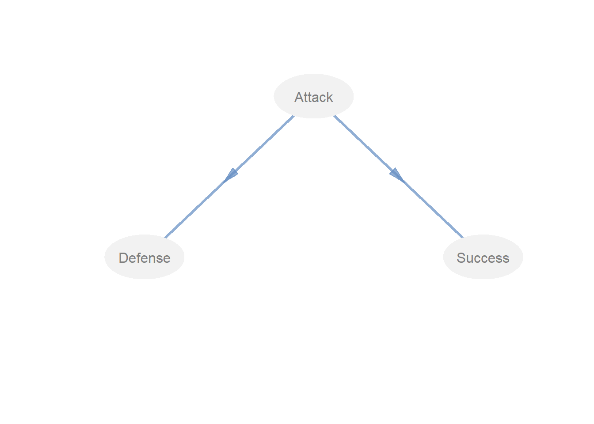


``` r
Attack <-  c(0, 1, 0)
Defense <- c(0, 0, 0)
Success <- c(1, 1, 0)

model_path2 <- rbind(Attack, Defense, Success)
colnames(model_path2) <- rownames(model_path2)

model_path2
#>         Attack Defense Success
#> Attack       0       1       0
#> Defense      0       0       0
#> Success      1       1       0
```


``` r
# graph structural model
innerplot(model_path2, txt.col = "black")
```

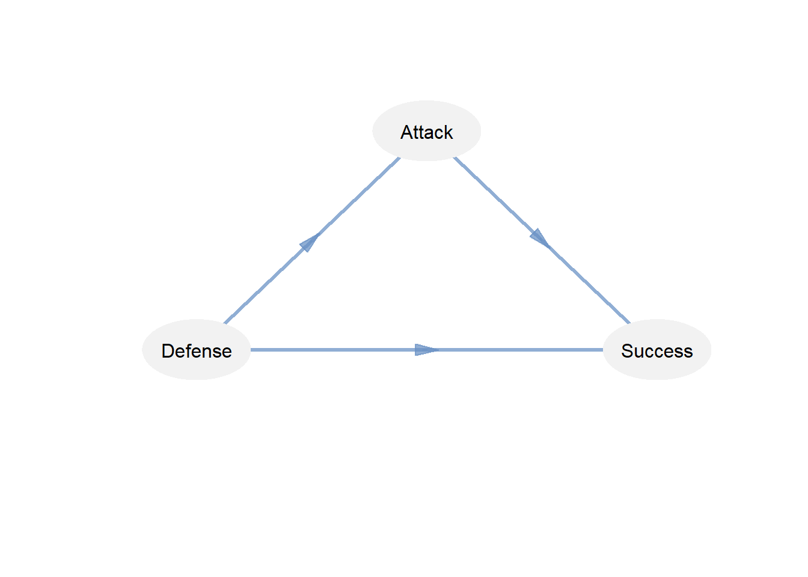


``` r
# define latent variable associated with
model_blocks <- list(1:4, 5:8, 9:12)

# vector of modes (reflective)
model_modes <- c("A", "A", "A")

# run plspm analysis
model_pls <- plspm(Data = spainfoot, path_matrix = model_path, blocks = model_blocks, modes = model_modes)

model_pls
#> Partial Least Squares Path Modeling (PLS-PM) 
#> ---------------------------------------------
#>    NAME             DESCRIPTION
#> 1  $outer_model     outer model
#> 2  $inner_model     inner model
#> 3  $path_coefs      path coefficients matrix
#> 4  $scores          latent variable scores
#> 5  $crossloadings   cross-loadings
#> 6  $inner_summary   summary inner model
#> 7  $effects         total effects
#> 8  $unidim          unidimensionality
#> 9  $gof             goodness-of-fit
#> 10 $boot            bootstrap results
#> 11 $data            data matrix
#> ---------------------------------------------
#> You can also use the function 'summary'
```


``` r
# Unidimensionality
model_pls$unidim
#>         Mode MVs   C.alpha     DG.rho  eig.1st   eig.2nd
#> Attack     A   4 0.8905919 0.92456079 3.017160 0.7923055
#> Defense    A   4 0.0000000 0.02601677 2.393442 1.1752781
#> Success    A   4 0.9165491 0.94232868 3.217294 0.5370492
```


``` r
plot(model_pls, what = "loadings")
```

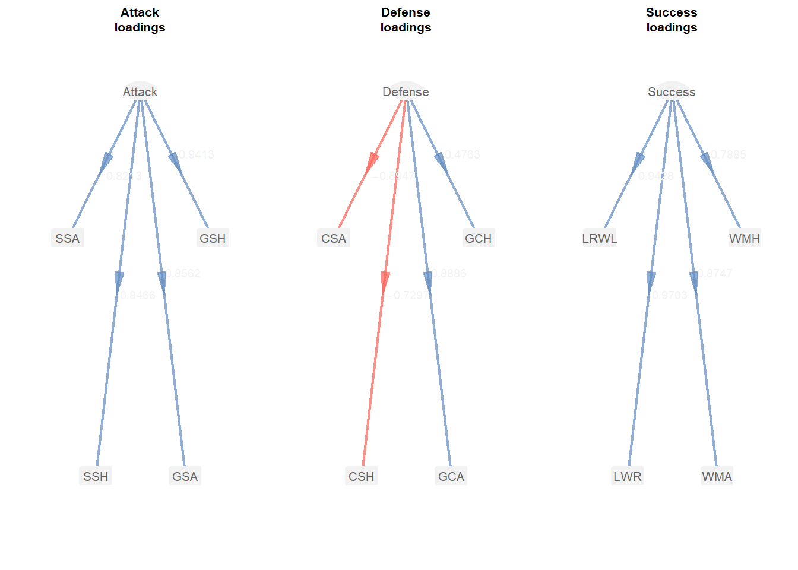


``` r
# Loadings and Communilaties
model_pls$outer_model
#>    name   block     weight    loading communality
#> 1   GSH  Attack  0.3474771  0.9412506   0.8859527
#> 2   GSA  Attack  0.2671782  0.8562398   0.7331465
#> 3   SSH  Attack  0.2922077  0.8466039   0.7167381
#> 4   SSA  Attack  0.2396012  0.8212987   0.6745316
#> 5   GCH Defense -0.1198790  0.4762965   0.2268583
#> 6   GCA Defense -0.4264164  0.8885714   0.7895590
#> 7   CSH Defense  0.2949470 -0.7297095   0.5324759
#> 8   CSA Defense  0.3898039 -0.8947452   0.8005689
#> 9   WMH Success  0.2484276  0.7884562   0.6216632
#> 10  WMA Success  0.2691511  0.8747163   0.7651285
#> 11  LWR Success  0.2947322  0.9703409   0.9415614
#> 12 LRWL Success  0.2998524  0.9428112   0.8888929
#>    redundancy
#> 1  0.00000000
#> 2  0.00000000
#> 3  0.00000000
#> 4  0.00000000
#> 5  0.05071506
#> 6  0.17650898
#> 7  0.11903706
#> 8  0.17897028
#> 9  0.49452090
#> 10 0.60864477
#> 11 0.74899365
#> 12 0.70709694
```


``` r
# Crossloadings
model_pls$crossloadings
#>    name   block     Attack    Defense    Success
#> 1   GSH  Attack  0.9412506 -0.5139001  0.9019257
#> 2   GSA  Attack  0.8562398 -0.3403294  0.7483558
#> 3   SSH  Attack  0.8466039 -0.4124617  0.7781795
#> 4   SSA  Attack  0.8212987 -0.3455460  0.6308989
#> 5   GCH Defense -0.1302683  0.4762965 -0.1620567
#> 6   GCA Defense -0.4633220  0.8885714 -0.5640722
#> 7   CSH Defense  0.3204993 -0.7297095  0.4850456
#> 8   CSA Defense  0.4235465 -0.8947452  0.5811253
#> 9   WMH Success  0.7126127 -0.4120502  0.7884562
#> 10  WMA Success  0.7720228 -0.7147787  0.8747163
#> 11  LWR Success  0.8454164 -0.5345709  0.9703409
#> 12 LRWL Success  0.8600973 -0.5910943  0.9428112
```


``` r
# Coefficient of Determination
model_pls$inner_model
#> $Defense
#>                Estimate Std. Error       t value   Pr(>|t|)
#> Intercept  5.504973e-17  0.2076918  2.650549e-16 1.00000000
#> Attack    -4.728148e-01  0.2076918 -2.276521e+00 0.03526176
#> 
#> $Success
#>               Estimate Std. Error      t value     Pr(>|t|)
#> Intercept 7.783183e-17  0.1065936 7.301735e-16 1.000000e+00
#> Attack    8.918971e-01  0.1065936 8.367266e+00 1.285711e-07
```


``` r
# Redundancy
model_pls$inner_summary
#>               Type        R2 Block_Communality
#> Attack   Exogenous 0.0000000         0.7525922
#> Defense Endogenous 0.2235539         0.5873656
#> Success Endogenous 0.7954804         0.8043115
#>         Mean_Redundancy       AVE
#> Attack        0.0000000 0.7525922
#> Defense       0.1313078 0.5873656
#> Success       0.6398141 0.8043115
```


``` r
# Goodness-of-fit
model_pls$gof
#> [1] 0.6034738
```


``` r
plot(model_pls, what = "inner", colpos = "#6890c4BB", colneg = "#f9675dBB", txt.col = "black", arr.tcol="black")
```

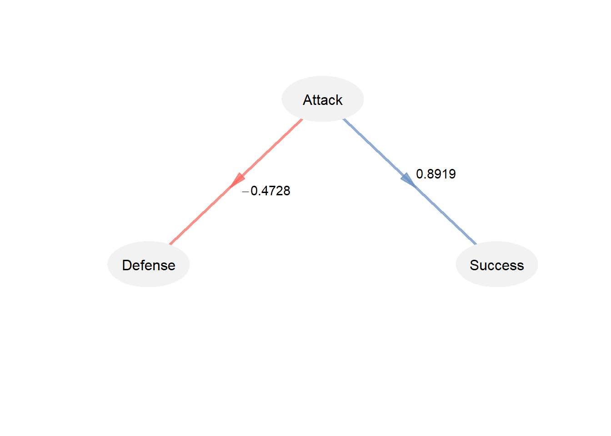

