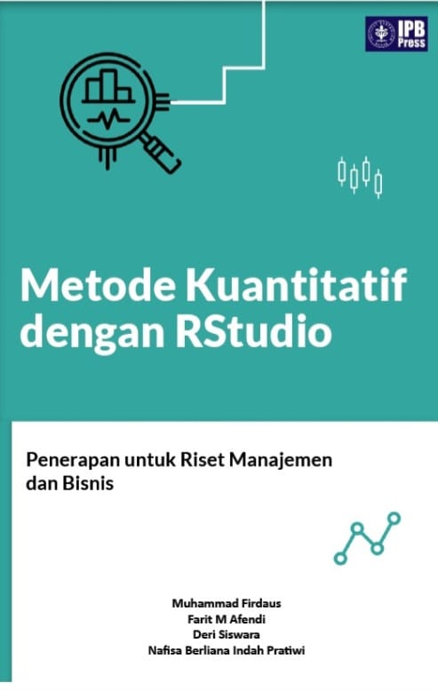

--- 
title: "Quantitative Methods with RStudio: Application for Management and Business Research"
author: "Deri Siswara and Nafisa Berliana Indah Pratiwi"
# date: "`r Sys.Date()`"
site: bookdown::bookdown_site
documentclass: book
bibliography: [book.bib, packages.bib]
description: |
  This is a minimal example of using the bookdown package to write a book.
  The HTML output format for this example is bookdown::bs4_book,
  set in the _output.yml file.
biblio-style: apalike
csl: chicago-fullnote-bibliography.csl
---

# Welcome {-}

This is the code version of *Quantitative Methods with RStudio: Application for Management and Business Research*, a book released in 2024 by IPB Press. The book was written by Muhammad Firdaus, Farit M Afendi, Deri Siswara, and Nafisa Berliana Indah Pratiwi. You can order the full version [here](https://bit.ly/buku-jurnal-rstudio2), which includes more detailed explanations.

Management quantitative analysis is widely utilized by students, lecturers, and researchers in Indonesia. This book aims to enhance the reputation of education and research in the country by presenting a variety of alternative analysis tools that are commonly used. Managers must accurately synthesize information during the decision-making process and prioritize various options precisely. Additionally, large volumes of transformed data such as customer identities and characteristics or consumer behavior survey results need to be synthesized properly.

The first chapter introduces RStudio software and the R programming language, while the second chapter focuses on nonparametric statistical analysis including correlation analysis of two nonparametric variables and causality relationships. Chapter three discusses logistic regression analysis for making practical decisions, followed by discriminant analysis in chapter four which models problems involving one dependent variable influenced by multiple independent variables.

Chapter five covers principal component analysis (PCA) and biplots to reduce a large selection of research variables into more compact dimensions. Chapter six delves into cluster analysis useful for mapping multiple entities whereas chapter seven comprehensively discusses factor analysis along with structural equation modeling (SEM), including PLS-SEM widely used for various problems involving latent variables such as prosperity, loyalty, and company performance.

The final chapter explores Analytic Hierarchy Process (AHP) aimed at determining priority choices based on hierarchical decision hierarchy using freely accessible RStudio software across all methods presented in this book. Updates will be made frequently. 

This book may contain bugs/errors which readers can report at *Buku.rstudio.ipb@gmail.com*
